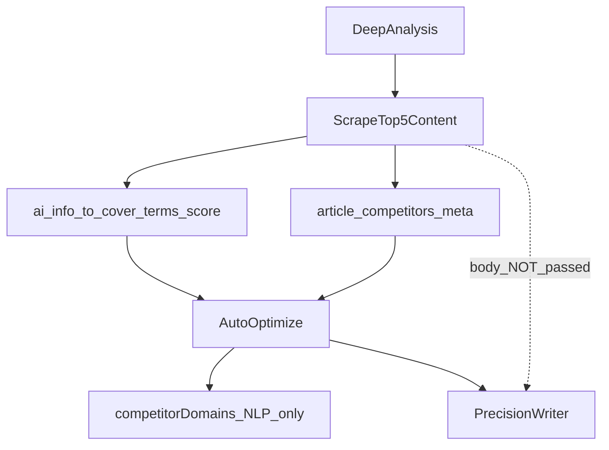
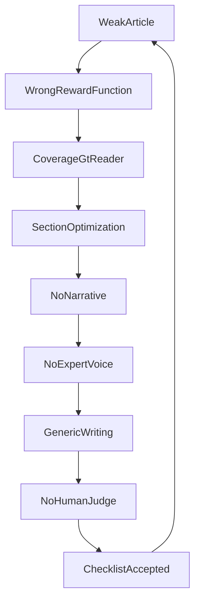
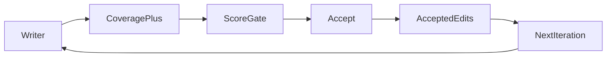
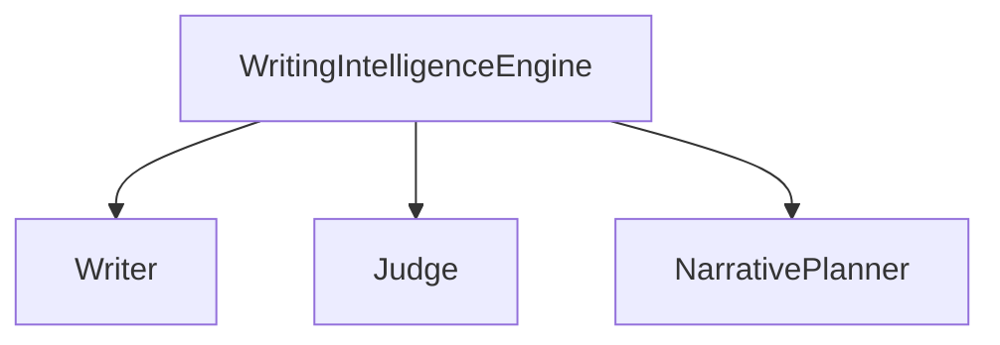
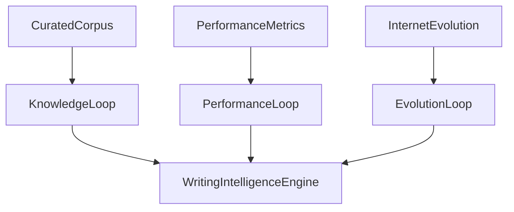

# Writing Intelligence Engine — speka produktu (v6)

**Typ:** diagnostyka AO + architektura platformy Writing Intelligence  
**Wersja:** 6.0  
**Data:** 2026-08-02  
**Case study:** AO (szantaż) vs [prodetektyw.pl/szantaz-co-robic](https://prodetektyw.pl/szantaz-co-robic/)  
**Kod dziś:** `ao-precision-v4.1` → `pages/api/articles/optimize-sections.ts` → `lib/ao/runPrecisionOptimize.ts` (+ `lib/optimizeWholeArticle.ts`)

### Pozycja w produkcie

**WIE nie jest modułem Auto Optimize.** To **centralna platforma wiedzy i decyzji pisarskich** Ranksmile — wspólny mózg dla obecnych i przyszłych funkcji.

```
                Writing Intelligence Engine
                         │
     ┌───────────────────┼───────────────────┐
     │                   │                   │
 Auto Optimize     Article Writer      Content Brief
     │                   │                   │
 Keyword Tracker    AI Coverage       Deep Analysis
     │                   │                   │
     └───────────────────┼───────────────────┘
                         │
                 Future Features
```

Perspektywa: nie „naprawmy AO”, lecz **zbudujmy warstwę, na której opiera się cały produkt**.

### Trzy warstwy implementacyjne (mapa zespołu)

Wszystkie komponenty WIE mieszczą się w trzech warstwach. Nazwy szczegółowe = podsystemy, nie równorzędne „produkty”.

| Warstwa | Odpowiedzialność | Podsystemy |
|---------|------------------|------------|
| **Layer 1 — Learn** | Skąd bierzemy wiedzę | Crawler, Analyzer, Pattern Discovery, Quality Judge, Pattern Store, Writing DNA, Knowledge / Performance / Evolution loops |
| **Layer 2 — Think** | Co zdecydować przed pisaniem | ReaderBrief, Narrative Planner, Policy Resolver, Competitor Synthesis, Principles → Patterns → Policy |
| **Layer 3 — Write** | Generacja, ocena, kalibracja | Writer, Judge (w tym A/B), Feedback Loop, explainability logs |

```
Layer 1 Learn     Crawler → Analyzer → Pattern Discovery → DNA
Layer 2 Think     ReaderBrief → Narrative → Policy → Competitor Synthesis
Layer 3 Write     Writer → Judge (+ A/B) → Feedback
```

### Nazewnictwo (słownik)

| Termin | Znaczenie |
|--------|-----------|
| **WIE** | Platforma — Learn / Think / Write |
| **Principle** | Trwała zasada („najpierw odpowiedz na główny problem użytkownika”) — wolno się starzeje |
| **Pattern** | Konkretna realizacja („problem-first lead”) — może się zmienić; podlega decay / evolution |
| **Writing DNA** | Warstwa wzorców Global / Industry / Brand (komponent Learn), nie cały WIE |
| **Policy Resolver** | Decision API: Principles + Patterns + conditions → decision bundle |
| **Competitor Synthesis** | Ephemeral JSON z Top N SERP (Source A) — Think, nie DNA |
| **AO** | Jeden z konsumentów WIE (Write path), nie właściciel reguł |

**Poza tą speką:** implementacja kodu (osobny plan).

---

# Part I — Diagnoza: dlaczego AO pisze słabe artykuły

## I.1 Wniosek w jednym zdaniu

AO jest racjonalnym **closerem Coverage + SEO**: nagradzany za obecność tematów, długość odpowiedzi pod headingami i trafienia NLP — więc produkuje encyklopedię z definicjami, listami i FAQ. Wzorzec Prodetektyw wygrywa **narracją, EEAT i przykładami z praktyki**, których pipeline **nie mierzy i nie gate’uje**.

To nie jest problem pojedynczego promptu ani wyboru LLM. To problem **celu optymalizacji** oraz braku **Writing Intelligence** (artykuł vs odpowiedź).

## I.2 AO vs Prodetektyw

| Aspekt | AO (obecnie) | Wzorzec Prodetektyw (docelowo) |
|--------|----------------|--------------------------------|
| Otwarcie | Definicja → słownik → prawo | Problem czytelnika → „Padłeś ofiarą?” |
| Narracja | Niezależne bloki H2 | problem → wyjaśnienie → przykład → działanie |
| Głos | Podręcznik / Wikipedia | Ekspert („w większości spraw…”) |
| Przykłady | Abstrakcyjne listy rodzajów | Messenger, były partner, Bitcoin, wyciek |
| Rytm akapitów | ~65–75 słów równo | 20 / 180 / 40 / 90 — tempo |
| CTA / dialog | Ostrożny („może”, „należy”) | Pytania–odpowiedzi, konkretne kroki |
| SEO / Coverage | Główny cel pipeline | Wtórne wobec RX + EEAT |

### Co widać w HTML AO (case „szantaż”)

1. H1 encyklopedyczny („definicja, rodzaje, kodeks…”).
2. Lead = definicja prawna + upychanie linków wewnętrznych.
3. Sekcje niezależne (każda H2 = mini-artykuł).
4. Bloki bold-checklista: Przykłady / Rodzaje / Skutki / Czy można / Ile lat.
5. Placeholdery `[Editor: dodaj odnośniki…]`.
6. FAQ z duplikatami pytań.
7. Artefakt `Last updated` w treści.

### Co robi wzorzec

Start od emocji ofiary → flow strach → konsekwencje → taktyka sprawcy → „nie dogaduj się” → profesjonalista → przykłady operacyjne → dialog z czytelnikiem → FAQ z konkretną normą (np. art. 191 § 1 k.k.).

## I.3 Prawdziwy pipeline AO dziś

```
artykuł / keyword
    ↓
baseline SEO + AI
    ↓
kandydaci luk (terms + uncovered/shallow + PAA)
    ↓
plan edycji sekcji („Execute ONLY the assigned objective”)
    ↓
LLM edit sekcji (lub whole-article fallback)
    ↓
local / semantic / score gates (accept gdy score ↑)
    ↓
early stop gdy SEO ≥ TARGET_SEO i AI ≥ TARGET_AI
    ↓
opcjonalny residual FAQ
    ↓
done
```

**Cele twarde** (`lib/optimizeMode.ts`): `TARGET_SEO = 90`, `TARGET_AI = 85`.  
**Ekonomia coverage** (`lib/liveCoverage.ts` `answerDepthQualityFloor`): ≥30 → quality 2; ≥140 → 3; ≥280 → 4.  
**FAQ** (`lib/aoFaqSection.ts`): Answer ALL; każdy `<p>` 120–350 znaków.

Brak etapu: Top 5 → synteza treści → information gain → outline rewrite → writer.

## I.4 Top 5 konkurentów z Deep Analysis — weryfikacja kodu

**Werdykt: AO nie czyta body Top 5.** Hipoteza „poziom 1–2, nie 3” jest potwierdzona.

### Co robi Deep Analysis

[`pages/api/articles/deep-analysis.ts`](../pages/api/articles/deep-analysis.ts):

- scrape SERP / competitors (treść do benchmarków, terms, coverage),
- zapis `article_competitors` (domain, url, title, headings_json, terms_json),
- cache `competitor_outlines_cache`,
- wylicza score targets / `ai_info_to_cover` / NLP terms.

### Co widzi AO

[`lib/articleContext.ts`](../lib/articleContext.ts) ładuje:

```ts
// domain, url, title, headings[], termsCount — BEZ body HTML / plain text
```

**Nie ładuje** `competitor_outlines_cache`.

W [`optimize-sections.ts`](../pages/api/articles/optimize-sections.ts) jedyne użycie `ctx.competitors`:

- `competitorDomains` → opcjonalne `enrichNlpTermsIfNeeded` gdy lista termów jest cienka.

`lib/ao/*` — **zero** referencji do competitors. Precision / whole-article / FAQ **nie dostają** treści Top 5.  
Headings w `intentProfile` to headings **własnego** HTML (`extractHeadings`), nie konkurencji.

| Poziom | Opis | Stan |
|--------|------|------|
| 1 Analiza | tematy, gaps, coverage, EEAT UI | Deep Analysis — tak |
| 2 Pośrednie | AO dostaje missing topics / terms / PAA | AO — tak |
| 3 Synteza treści Top 5 → Writer | model czyta 5 artykułów → IG → narracja | **brak** |



**Implikacja:** AO optymalizuje „pokryj checklistę”, nie „napisz lepszy artykuł niż te 5 wyników”.

---

# Part II — Braki pogłębione

## II.1 Root Cause Tree



## II.2 Artykuł vs odpowiedź

AO **nie tworzy artykułu** — tworzy **odpowiedź** (Q&A / coverage filler).

| Copywriter (prowadzi czytelnika) | AO dziś |
|----------------------------------|---------|
| User Intent → Emotion → Curiosity → Trust → Education → Decision → CTA | Keyword → Definitions → Coverage → FAQ → Done |

## II.3 Reward Function & Optimization Target



System uczy się przez accept, że checklista = sukces (**reward hacking**).

Docelowo: multi-objective reward + **veto Judge** + opcjonalnie **A/B Write** (dwa warianty → wybór lepszego) — score↑ + RX↓ = reject.

## II.4 Prompt Hierarchy

| Ścieżka | ~imperatywy | Charakter |
|---------|-------------|-----------|
| Precision | ~8–12 | Bounded edit, HTML only, ONLY objective — bez Stop Slop / brand |
| Whole-article | ~35–45+ | SHARED + STRUCTURE + Stop Slop + gaps/effort |
| FAQ | ~18–22 | Answer ALL + długość 120–350 |

Źródła: `lib/ao/editPlan.ts`, `lib/optimizeWholeArticle.ts`, `lib/stopSlopPrompt.ts`, `optimize-sections.ts`.

Checklist hierarchy > style hierarchy. Przebudowa: cienki prompt + Policy Resolver / Judge, nie 40 bulletów w system prompt.

## II.5 Research & Reader Modeling

Dziś brak Persona → Intent → Pain → Outcome. Jest `intentProfile` (zawsze informational), coverage who/why, PAA/terms z DA; outline nie wchodzi do AO.

**Docelowy `ReaderBrief` (Layer 2 — Think):**  
`Persona → SearchIntent → PainPoints → EmotionalState → KnowledgeLevel → DesiredOutcome → NarrativeTemplate → Outline`

## II.6 Expert Voice & Information Gain

EEAT = proxy (nie gate AO). `gapEngine` IG nie podłączony.  
Coverage: *czy temat istnieje?* vs Google: *czy dowiedziałem się czegoś nowego?*

## II.7 Content Density / Pattern Diversity / Sentence Variety

| KPI | Definicja | Problem dziś |
|-----|-----------|--------------|
| Content Density | claims + examples / 1k słów | dużo słów, mało informacji |
| Pattern Diversity | rotacja template’ów | zawsze Definicja → Rodzaje → FAQ |
| Paragraph Variety | wariancja długości | ~70 słów równo |

## II.8 Metryki dziś vs docelowo

| Kryterium | Obecnie | Docelowo |
|-----------|---------|----------|
| SEO / AI Coverage | Gate | Tak (bounded) |
| Flow / EEAT / przykłady / RX / IG | Nie / proxy | Tak |
| Pattern effectiveness | Nie | Tak |
| Outcome (CTR / dwell / conv) | Nie | Performance Loop |
| Internet evolution (formaty, AIO) | Nie | Evolution Loop |
| Principle vs Pattern | Nie | Tak |
| Variant A/B Write | Nie | Tak |
| Pattern Discovery gate | Nie | Candidate → Validate → Store |

---

# Part III — Writing Intelligence Engine (platforma)

## III.1 Shared brain (najcenniejszy element)

Większość systemów: Writer → tekst → Judge (różne kryteria).  
Ranksmile: **jeden engine** karmi Writer, Judge i Narrative.



Te same Principles / Patterns / effectiveness dla generacji i oceny.

## III.2 Trzy pętle uczenia (Learn)



| Loop | Input | Pytanie | Uwaga |
|------|--------|---------|--------|
| **Knowledge** | Curated corpus (+ opcjonalnie insighty ze Synthesis) | Jak piszą najlepsi? | Source B → DNA |
| **Performance** | CTR, avg time, bounce, conversions (np. 30 dni) | Co działa u klientów? | Outcome Learning |
| **Evolution** | Nowe schematy, formaty, odpowiedzi, AI Overviews, prezentacja treści | Co się zmienia w internecie? | **Nie** to samo co Top5 SERP keyword |

**Evolution ≠ SERP snapshot.** Top5 danego keywordu = Source A (Think / Synthesis). Evolution Loop śledzi **zmiany sposobu pisania i prezentacji w sieci w czasie** (nowe layouty odpowiedzi, AIO-style bloki, checklist vs story, długości leadów w branży, nowe konwencje EEAT). To, co działało dwa lata temu, nie musi działać za dwa lata — Principles zostają, Patterns ewoluują.

**Anti-pattern:** uczenie tylko z treści bez outcome i bez ewolucji formatów.

## III.3 Source A vs Source B

| | Source A — dynamiczne | Source B — stałe |
|--|----------------------|------------------|
| Input | Deep Analysis Top N | Curated: Ahrefs, HubSpot, ProDetektyw, GOV, Backlinko, client |
| Output | Competitor Synthesis (ephemeral) | DNA / Pattern Store (+ Principles) |
| Warstwa | Think | Learn |
| Ryzyko | Drift SERP | Stale bez decay / Evolution |

**Zakaz:** automatyczne wlewanie niesortowanego Top5 do DNA.

## III.4 Principles vs Patterns

| | Principle | Pattern |
|--|-----------|---------|
| Przykład | „Najpierw odpowiedź na główny problem użytkownika” | „Problem-first lead (H1+pierwszy akapit)” |
| Trwałość | Prawie nie starzeje się | Może się zmienić (Evolution / decay) |
| Rola | Fundament Policy | Konkretna realizacja pod conditions |

Hierarchia decyzji:

```
Principles  →  Patterns  →  Policy (decision bundle)
```

Policy Resolver **nigdy** nie łamie Principle dla chwilowego Pattern z wysokim confidence SERP.

## III.5 Pattern Discovery (Learn)

Analyzer nie wrzuca od razu do Store.

```
Candidate Pattern
    ↓
Validate (Quality Judge / Principle check / min evidence)
    ↓
Accept | Reject
    ↓
Pattern Store (+ DNA version bump jeśli batch)
```

Pattern też przechodzi Judge — nie „wszystko, co Analyzer zobaczył”.

## III.6 Conditional Policy (Think)

```
Pattern: Problem first
WHEN search_intent = informational
 AND industry = legal
 AND emotion = high
```

vs

```
Pattern: Definition first
WHEN industry = seo_saas
 AND emotion = low
 AND content_shape = technical_canonical
```

Oba OK. Konflikt → match conditions + wagi DNA (Global 20% / Industry 40% / Brand 40%), nie średnia booleans.

Policy = **API**, nie blob promptu:

| Pytanie | Odpowiedź |
|---------|-----------|
| Jak otworzyć? | problem_first · conf 0.97 · eff 0.89 · principle: answer_user_problem_first |
| Ile przykładów? | min 2 |
| CTA? | soft · last_10_percent |

## III.7 Pattern Store — rekord

```json
{
  "kind": "pattern",
  "pattern": "Problem before definition",
  "principle_id": "answer_user_problem_first",
  "reason": "Highest engagement for high-emotion informational articles",
  "conditions": {
    "search_intent": ["informational"],
    "industry": ["Legal"],
    "emotion": ["high"]
  },
  "weight": 0.94,
  "confidence": 0.92,
  "effectiveness": { "used": 821, "success_rate": 0.89 },
  "frequency": 182,
  "evidence": 43,
  "source": "ProDetektyw",
  "industry": "Legal",
  "last_seen": "2026-08-02",
  "dna_version": 3
}
```

Principle (osobny store / tabela):

```json
{
  "kind": "principle",
  "id": "answer_user_problem_first",
  "statement": "Najpierw odpowiedz na główny problem użytkownika",
  "immutable_weight": 1.0
}
```

| Pole | Rola |
|------|------|
| `confidence` | Pewność z Knowledge / Discovery |
| `effectiveness` | Sukces Judge + Performance |
| `reason` | Explainability |
| `conditions` | Kiedy stosować Pattern |

Conflict: conf 0.95 + success 0.61 → **preferuj effectiveness**.  
Decay `last_seen` → confidence↓.  
DNA v1→v2→v3 z **rollback** (nie overwrite).

## III.8 Competitor Synthesis (Think) — priorities

```json
{
  "critical": ["wyjaśnij art. 191 k.k."],
  "important": ["nie płać, zbierz dowody, zgłoś"],
  "optional": ["ciekawostka Messenger / sextortion"],
  "opening_style": { "problem_first": true, "emotion": "high" },
  "section_patterns": ["problem", "consequences", "solution", "examples", "faq"],
  "expert_claims": [],
  "storytelling": [],
  "examples": ["Messenger", "Były partner", "Bitcoin"],
  "cta": {},
  "faq": {},
  "information_gain": [],
  "meta": { "keyword": "", "captured_at": "", "competitor_urls": [], "quality_scores": [] }
}
```

~1–5 KB / ~1k tokenów — nie 70k HTML. Budżet słów: critical > important > optional. TTL / discard po runie.

## III.9 Layer 3 — Write: Judge, A/B, Feedback

### Pojedynczy Judge (minimum)

Writer → Judge (te same policies) → accept / veto + explainability log.

### Variant test (wymaganie jakości)

```
Policy / Narrative
    ↓
Writer A ──→ Judge A ──┐
Writer B ──→ Judge B ──┴→ Select winner → publish / apply
```

WIE generuje **dwa warianty** (np. różne opening patterns zgodne z conditions albo różny narrative template) i wybiera lepszy według Judge (RX + EEAT + IG + bounded score). To nie zastępuje DNA versioning — to runtime selection.

### Feedback Loop

Judge scores → update `effectiveness` wzorców z explainability log (przed pełnym Outcome).

### Outcome (Performance Loop)

Publish → 30d → CTR / time / bounce / conversions → weights++.

### Evolution Loop (input do Learn)

Okresowy skan zmian formatów / AIO / konwencji → Candidate Patterns → Discovery gate → Pattern Store (Principles bez zmian, chyba że świadoma rewizja).

## III.10 Explainability

```
decision: problem_first
principle_id: answer_user_problem_first
confidence: 0.91
effectiveness: 0.89
source_layer: industry_dna
matched_conditions: { intent, industry, emotion }
reason: "..."
dna_version: 3
variant: A|B
```

## III.11 Onboarding (Learn → Brand DNA)

```
Dodaj 5–N URL branży → Scrape → Quality Judge → Pattern Discovery → Brand DNA → Done
```

Widok: Brand Voice, Expert Style, Narrative, CTA, EEAT, Variety, IG + explainability.

---

# Part IV — Fazy i KPI

## IV.1 Ścieżka Write (konsument AO / Writer)

```
Layer 2: ReaderBrief → Synthesis → Policy ← DNA/Principles → Narrative
    ↓
Layer 3: Writer A/B → Judge select → SEO/Coverage bounded → Feedback
    ↓
(po publish) Performance Loop
(okresowo) Evolution Loop → Learn
```

## IV.2 Fazy implementacji

### Filar A — AO jako pierwszy konsument WIE (ROI)

1. Judge veto (RX / EEAT / IG / variety).  
2. ReaderBrief + Narrative Planner.  
3. Competitor Synthesis (priorities) z DA → AO.  
4. Bounded Coverage + ExpertVoice w precision.  
5. (wczesne) runtime A/B dwóch wariantów sekcji / leadu.

### Filar B — Layer 1 Knowledge

6. Curated ingest + Quality Judge + **Pattern Discovery** gate.  
7. Principles store + Patterns store; Policy Resolver; DNA tiers.  
8. Shared engine: Writer + Judge + Narrative.  
9. Explainability + Feedback → effectiveness.  
10. Decay + DNA versioning / rollback.  
11. Onboarding curated URLs.  
12. Podpięcie kolejnych konsumentów: Brief, Deep Analysis hints, Coverage copy.

### Filar C — Performance + Evolution

13. Post-publish metrics → Outcome Learning.  
14. Evolution Loop (formaty / AIO / konwencje) → Candidate Patterns.  
15. DNA A/B gated wynikami.  
16. GOLD / BAD corpora (opcjonalnie).

### Zakazy

- SERP-only DNA.  
- DNA / Principles jako blob w prompcie.  
- Uśrednianie sprzecznych Patterns bez conditions.  
- Dump 5× HTML do Writera.  
- Pamięć artykułów forever.  
- Łamanie Principle dla chwilowego Pattern.  
- Traktowanie WIE jako „feature AO”.

## IV.3 KPI

| KPI | Cel |
|-----|-----|
| Blind test | WIE consumer ≥ top-3 / wzorzec w ≥ 2/3 case’ów |
| Score floor | SEO/AI powyżej floora |
| Density / variety | ↑ vs baseline AO |
| Synthesis critical coverage | critical items obecne w output |
| Explainability | 100% decyzji z logiem |
| A/B win rate | Judge preferuje winner z mierzalną deltą RX |
| Discovery precision | % Candidate→Accept; niska false-positive rate |
| Effectiveness coverage | patterns z known success_rate |
| Outcome correlation | pattern → CTR/dwell/conv |
| Evolution freshness | % patterns z last_seen w oknie; Principles stable |

## IV.4 Pliki źródłowe (stan obecny)

| Obszar | Ścieżka |
|--------|--------|
| API AO | `pages/api/articles/optimize-sections.ts` |
| Precision | `lib/ao/runPrecisionOptimize.ts` |
| Cele score | `lib/optimizeMode.ts` |
| Coverage | `lib/liveCoverage.ts` |
| FAQ | `lib/aoFaqSection.ts` |
| Plan / candidates | `lib/ao/editPlan.ts`, `lib/ao/buildCandidates.ts` |
| Context | `lib/articleContext.ts` |
| Deep Analysis | `pages/api/articles/deep-analysis.ts` |
| Whole-article | `lib/optimizeWholeArticle.ts` |
| Spec AO v4 | `docs/precision-auto-optimize-v4-spec.md` |

---

## Podsumowanie

1. AO dziś = score closer → Wikipedia + FAQ; Top5 body nie wchodzi do Writera.  
2. **WIE = platforma Ranksmile** (nie moduł AO) — Learn / Think / Write.  
3. Trzy pętle: Knowledge + Performance + **Evolution**.  
4. **Principles** (trwałe) vs **Patterns** (zmienne) → Policy.  
5. **Pattern Discovery** (Candidate → Validate → Store).  
6. Shared engine Writer / Judge / Narrative + **A/B Write**.  
7. Source A Synthesis (SERP dziś) ≠ Source B DNA (curated) ≠ Evolution (zmiany internetu).  
8. Długoterminowa przewaga: uczenie z jakości treści, wyników klientów i ewolucji formatów.

---

*Ranksmile · Writing Intelligence Engine speka v6 · 2026-08-02 · case Prodetektyw vs AO*
