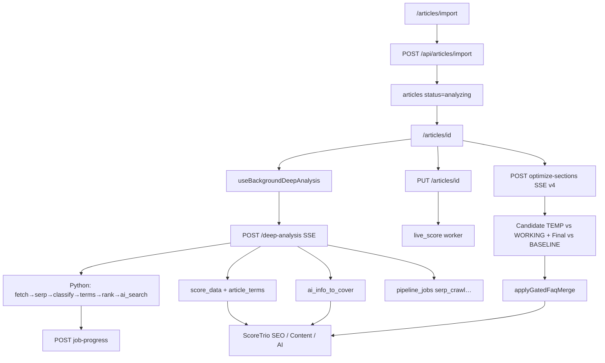
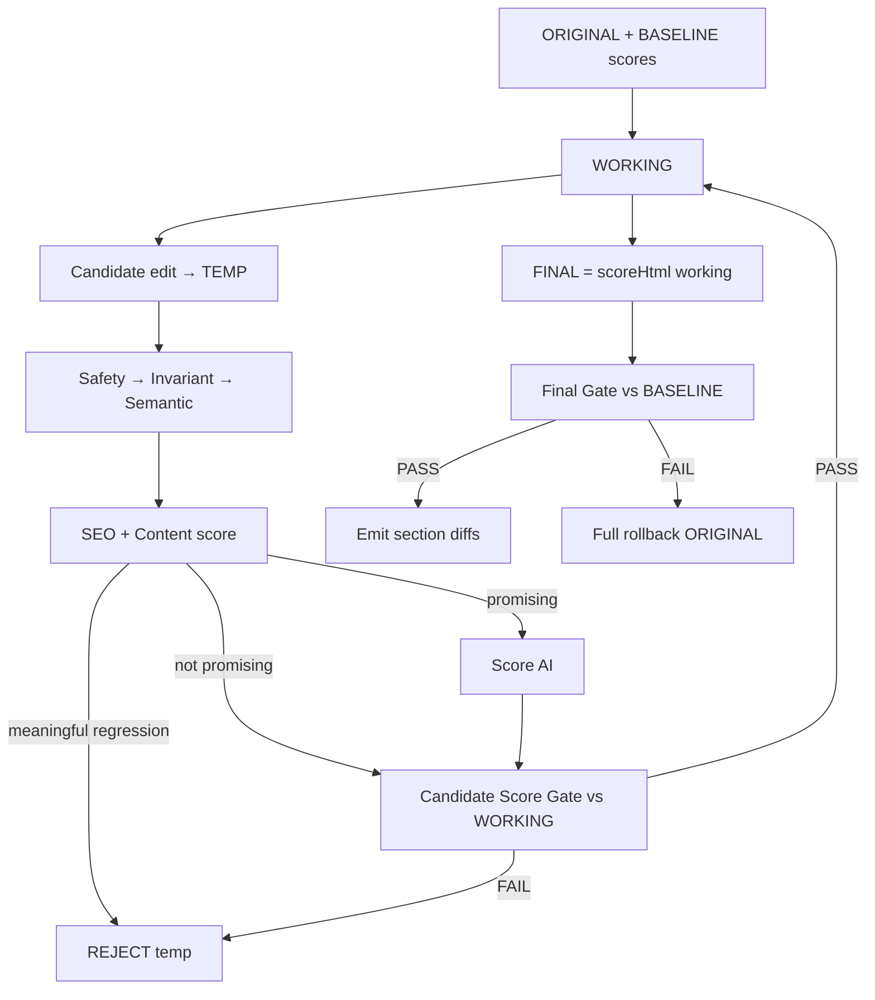
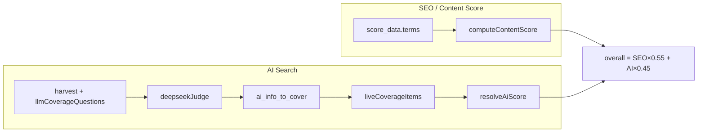

# Ranksmile — Content Editor, Deep Analysis, Scoring & Auto-Optimize

**Cel dokumentu:** szczegółowy raport architektury end-to-end do code review (ChatGPT / zewnętrzny reviewer).  
**Repo:** Ranksmile (Next.js Pages Router + Python sidecar + BullMQ pipeline).  
**Data wygenerowania:** 2026-07-29  
**Zastępuje:** wersję z 2026-07-28 (ta sama ścieżka pliku).  
**Zakres:** import, new content, deep analysis, Auto-Optimize **Precision v4**, AI Search / coverage, SEO scoring, content editor, pipeline workers.

> Ten dokument opisuje **jak system działa w kodzie**, nie jak powinien działać w idealnym produkcie. Ścieżki plików są względem roota repozytorium.

**Specyfikacje AO:**
- [Precision Auto-Optimize v4](./precision-auto-optimize-v4-spec.md) — **P0 target / zaimplementowane**
- [Precision Auto-Optimize v3](./precision-auto-optimize-v3-spec.md) — poprzedni kontrakt (candidates / IntentGuard / EditSafetyGate)

---

## Spis treści

1. [Mapa systemu (warstwy)](#1-mapa-systemu-warstwy)
2. [Statusy artykułu i jobów](#2-statusy-artykułu-i-jobów)
3. [Flow: Import URL](#3-flow-import-url)
4. [Flow: New Content (keyword → wizard → generate)](#4-flow-new-content)
5. [Flow: Deep Analysis](#5-flow-deep-analysis)
6. [Flow: Content Editor](#6-flow-content-editor)
7. [SEO / Content Score — punktowanie](#7-seo--content-score--punktowanie)
8. [AI Search — coverage, harvest, scoring](#8-ai-search--coverage-harvest-scoring)
9. [ScoreTrio — jak UI składa trzy gauge’e](#9-scoretrio--jak-ui-składa-trzy-gaugee)
10. [Flow: Auto-Optimize Precision v4](#10-flow-auto-optimize-precision-v4)
11. [Pipeline v7 (workers po deep analysis)](#11-pipeline-v7-workers-po-deep-analysis)
12. [Ranking Score (sidecar) vs Content Score](#12-ranking-score-sidecar-vs-content-score)
13. [Domain AI Visibility (osobny produkt)](#13-domain-ai-visibility-osobny-produkt)
14. [Diagramy](#14-diagramy)
15. [Checklist plików do review](#15-checklist-plików-do-review)
16. [Znane limity / pułapki (ważne dla review)](#16-znane-limity--pułapki)

---

## 1. Mapa systemu (warstwy)

| Warstwa | Ścieżki / technologia |
|--------|------------------------|
| UI artykułów | `pages/articles/*`, `components/articles/*`, `components/ranksmile/*` |
| Hooks | `hooks/useBackgroundDeepAnalysis.ts`, `hooks/articles/useArticleScore.ts`, `hooks/articles/useArticleOptimize.tsx`, `hooks/articles/useArticleEditorState.ts` |
| API (Next) | `pages/api/articles/*`, `pages/api/pipeline/jobs.ts`, `pages/api/ai-visibility/*` |
| Lib (scoring / coverage) | `lib/contentScore.ts`, `lib/scoreArticleHtml.ts`, `lib/aiSearchScore.ts`, `lib/aiCoverage.ts`, `lib/harvestAiCoverage.ts`, `lib/llmCoverageQuestions.ts`, `lib/buildCoverageSnapshot.ts`, `lib/computeLiveArticleScores.ts` |
| Lib (AO Precision v4) | `lib/ao/*`, `lib/aoFaqSection.ts`, `lib/optimizeMode.ts`, `lib/optimizeSectionEvents.ts`, `lib/optimizeWholeArticle.ts` |
| Python sidecar | `python-sidecar/pipeline/runner.py`, `python-sidecar/main.py` |
| Pipeline workers | `lib/workers/*`, `lib/pipeline/*`, `scripts/pipeline-workers.ts` |
| DB (kluczowe tabele) | `articles`, `analysis_jobs`, `article_terms`, `article_competitors`, `ai_visibility_runs`, `pipeline_jobs`, `ai_vis_scans`, `article_versions` |

**Stos:** Next.js (Pages) + TipTap + Emotion/Sentry UI + DataForSEO + DeepSeek (judge / AO) + Anthropic gateway + BullMQ/Redis.

---

## 2. Statusy artykułu i jobów

### `articles.status`

| Status | Kiedy ustawiany |
|--------|-----------------|
| `draft` | Create; po udanym deep-analysis; po failu generate; reconcile gdy job done/failed/stale |
| `analyzing` | Start deep-analysis; import z `startAnalysis` / sidecar gotowy |
| `generating` | Start `POST /api/articles/[id]/generate` |
| `error` | Hard fail deep-analysis / generate |
| `accepted` | Accept flow |
| `published` | WordPress publish |

**Ważne:** przy load edytora `resolveAnalyzingStatusOnLoad` (`lib/deepAnalysisProgress.ts`) **nie** flipuje `analyzing` → `draft` gdy brak joba (404) — inaczej hook nigdy nie wystartuje deep analysis po imporcie.

### `analysis_jobs.status`

`queued` → `running` → `done` | `failed` (oraz `superseded` przy nowym jobie).  
Stage’e: `fetch_page`, `scrape_serp`, `classify_content`, `extract_terms`, `score_ranking`, `ai_search`, `finalizing` (Node — **nie** stale).

### Stale detection

`isStaleDeepAnalysisJob`: ~90s running bez heartbeat, ~45s queued. Stage `finalizing` wyłączony ze stale.

---

## 3. Flow: Import URL

### Entry UI

| Ścieżka | Plik |
|--------|------|
| Formularz importu | `pages/articles/import.tsx` |
| Inline w edytorze | `components/articles/ArticleEditor.tsx` |
| Recommendations | `pages/sites/[domain]/recommendations.tsx` |
| Lista → Import | `pages/articles/index.tsx` |

### API: `POST /api/articles/import`

1. Auth + tenancy + SSRF (`assertPublicUrl`).
2. Fetch HTML → opcjonalnie Puppeteer.
3. Cheerio extract → INSERT `articles` (`status=analyzing` gdy `startAnalysis`).
4. Fire-and-forget keywords enrich.

### Po imporcie

```
Import → articles(analyzing) → writeAnalyzeSession → /articles/{id}
  → useBackgroundDeepAnalysis → deep-analysis SSE + poll
  → ProgressPanel + CircuitBoard → done → draft + unlock
```

Import **nie** enqueuuje pipeline workers — deep analysis startuje z edytora.

---

## 4. Flow: New Content

### A. Keyword → Deep analysis → Wizard → Generate

1. `pages/articles/new.tsx` → `/articles/deep-analysis?...&flow=new`
2. Keyword-mode deep-analysis (pusty URL) → skeleton article
3. Wizard: `content-type` → `context` → `writing-mode` (`wizard_state`)
4. `generating.tsx` → `POST .../generate` → sidecar → `draft`
5. Resume: `lib/articleFlow.ts`

### B. Pusty draft

`POST /api/articles` — bez AI.

---

## 5. Flow: Deep Analysis

### Entry

Import (hook), `pages/articles/deep-analysis.tsx`, keyword-research, `lib/deepAnalysis.ts`.

### Orchestrator: `pages/api/articles/deep-analysis.ts`

Auth → SSE → `status=analyzing` → sidecar `/pipeline/deep-analysis` → `job-progress` → Node `finalizing` (score_data, terms, coverage harvest, enqueue v7) → `draft`.

### Sidecar stages

```
fetch_page → scrape_serp → classify_content → extract_terms → score_ranking → ai_search
```

### Progress UI

| Element | Plik |
|---------|------|
| Stage → UI | `lib/deepAnalysisProgress.ts` |
| Hook | `hooks/useBackgroundDeepAnalysis.ts` |
| Panel | `components/articles/DeepAnalysisProgressPanel.tsx` |
| Circuit | `components/ranksmile/AnalysisCircuitBoard.tsx` |

### Persist po DA

`score_data`, `content_score`, `article_terms`, `ai_info_to_cover`, `ranking_*`, `ai_visibility_runs`, `pipeline_jobs` (serp_crawl ± visibility).

---

## 6. Flow: Content Editor

| Rola | Plik |
|------|------|
| Page | `pages/articles/[id]/index.tsx` |
| TipTap | `components/articles/ArticleEditor.tsx` |
| Sidebar | `ArticleEditorSidebar` → `ContentScorePanel` / `WriteOptimizePanel` |
| Pipeline chips | `PipelineStatusStrip` |

**Save:** debounce ~800ms; wstrzymany przy AO / deep analyzing; po save → `enqueueLiveScoreOnSave`.

**Locki:** deep analyzing → TipTap readOnly; AO review → Accept/Reject nodes.

---

## 7. SEO / Content Score — punktowanie

### SSO: `lib/contentScore.ts`

`computeContentScore` — sloty (words, headings, NLP, readability, FAQ/PAA, …) → 0–100.  
Model `competitor` → `lib/competitorContentScore.ts`.

### Live unifikacja: `lib/scoreArticleHtml.ts`

```
seo     = computeContentScore(... + live coverage entities)
ai      = computeCoverageScores(liveItems).overall || score_data.ai_score
overall = computeOverallContentScore(seo, ai)   // SEO×0.55 + AI×0.45
```

Używane przez: edytor, AO stream, save, `live_score` worker.

### Persist

| Pole | Znaczenie |
|------|-----------|
| `articles.content_score` | Overall w listach |
| `score_data.seo_score` | SEO |
| `score_data._content_score` | Overall cache |
| `score_data.terms` / `article_terms` | NLP |

---

## 8. AI Search — coverage, harvest, scoring

### Harvest

`lib/harvestAiCoverage.ts` + `lib/harvest/providers.ts`:
- `dataforseo_llm` → `fetchLlmCoverageQuestions` (cache key **v3**)
- `serp_paa` → PAA (bez fałszywego provenance AI Overview)

Engines: `ai_overview`, `ai_mode`, `chat_gpt`, `gemini`, `perplexity` (+ Reddit gdy PAA = reddit.com).

### Snapshot graded

`assembleCoverageItems` → `judgeCoverageItems` (DeepSeek 0–5) → `articles.ai_info_to_cover`.

### Live re-score

`lib/liveCoverage.ts` — presence flip bez ponownego LLM (fakty frozen).

### Resolve AI

`resolveAiScore` = max(V2 facts, coverage overall, summary).  
`computeOverallContentScore` = SEO×0.55 + AI×0.45.

### UI

`WriteOptimizePanel` — Info to cover; **Apply** usunięte; Copy + Covered zostają.

---

## 9. ScoreTrio — jak UI składa trzy gauge’e

**`components/articles/ScoreTrio.tsx`** → `ScoreGauge`

| Pozycja | Etykieta | Źródło |
|---------|----------|--------|
| Lewy | SEO | `scoreArticleHtml().seo` |
| Środek | Content Score | `computeOverallContentScore(seo, ai)` |
| Prawy | AI Search | coverage / `ai_score`; `pending` gdy brak AI |

### Delty podczas AO (signed)

| Ścieżka | Zachowanie |
|--------|------------|
| `pages/articles/[id]/index.tsx` | **Signed:** `live − preBaseline`; pokazuje ≠ 0 (↑ zielony / ↓ czerwony) |
| `ScoreGauge` `delta` | Signed badge; clamp tylko score 0–100, **nie** delty |
| `ArticleEditorSidebar.tsx` | **Legacy:** nadal `Math.max(0, …)` — tylko dodatnie (pułapka) |
| Server `done.deltas` | Emitowane; klient **nie** czyta — UI rescoring lokalny |

Kolory pasm: `lib/scoreColor.ts` (low &lt;33 / mid / high ≥66).

---

## 10. Flow: Auto-Optimize Precision v4

> **Filozofia:** AO does not owe an edit. AO owes non-regression.  
> `69/63/56 → 69/63/56` (no safe edit) = SUCCESS.  
> `69/63/56 → 65/58/50` = MUST BE IMPOSSIBLE TO ACCEPT.

Spec: [precision-auto-optimize-v4-spec.md](./precision-auto-optimize-v4-spec.md).  
`PROMPT_VERSION = 'ao-precision-v4.1'`.

### Entry

- CTA Auto-Optimize → `useArticleOptimize.handleAutoOptimizeSections`
- Review: TipTap `contentOptimizer` nodes + Accept/Reject
- Credit: org 5h token pool (`lib/aiTokenUsage.ts`)

### API: `POST /api/articles/optimize-sections` (SSE)

Plik: `pages/api/articles/optimize-sections.ts`

1. `buildArticleContext` + NLP merge  
2. Baseline SEO/AI/Content; **`shouldSkipOptimize`** (SEO≥80 ∧ AI≥65) → `already_optimal`, zero LLM  
3. Strategia: `resolveOptimizationStrategy()` → default **`precision`**; whole-article **tylko** explicit body/env (`AO_WHOLE_ARTICLE_FALLBACK`) — nigdy auto po fail precision  
4. **`runPrecisionOptimizeV4`** (`lib/ao/runPrecisionOptimize.ts`)  
5. **FAQ round** → `applyGatedFaqMerge` (te same dual gates)  
6. SSE: `meta` → `progress` → `section` (final-only diffs) → `done` (`baseline`, `deltas`, `traceSummary`)

**AO nie idzie przez BullMQ** — synchroniczne w requestcie.

### Dual score gates (MUST)

| Gate | Porównanie | Efekt FAIL |
|------|------------|------------|
| **Candidate** | TEMP vs **WORKING** | Odrzuć temp; working niezmieniony |
| **Final** | re-score(`working.html`) vs **immutable BASELINE** | **Full rollback** do original HTML |

```
ORIGINAL → BASELINE (HTML + scores + hash)
              ↓
         WORKING (mutuje tylko po Candidate PASS)
              ↓
    per candidate: TEMP → Safety → Invariant → Semantic
         → SEO+Content → (regresja? REJECT, bez AI)
         → promising (SEO≥ ∧ Content≥)? → AI
         → Candidate Score Gate
              ↓
    FINAL re-score(working) → Final Gate vs BASELINE
         PASS → emit section diffs | FAIL → rollback original
```

### Score types (`lib/ao/aoScoreDelta.ts`)

```ts
ScoreAvailability = 'available' | 'unavailable' | 'stale' | 'error'
ScoreGateMode     = 'strict_non_regression' // P0 only
minMeaningfulDelta = 2  // noise floor, nie absolutne zero-drop
```

- Unavailable / error AI ≠ unchanged → `SCORE_INCONCLUSIVE` (reject).  
- Promising = deterministycznie `SEO ≥ working ∧ Content ≥ working` przed kosztem AI.

### Snapshots

| Snapshot | Plik / typ | Mutowalność |
|----------|------------|-------------|
| Original / Baseline | `captureAoBaseline` | Immutable |
| Working | `AoDocumentSnapshot` w pętli v4 | Tylko po Candidate PASS |
| Temp | merge sekcji + score | Discard przy reject |
| Final | `scoreHtml(working.html)` | Nigdy dziedziczone z last candidate |

### Critical Content Map + targeting

- `lib/ao/criticalContentMap.ts` — multi-candidate definitions / direct answers / entities (nie „first para = definition”).  
- `lib/ao/sectionTargeting.ts` — `selectSectionTarget`; low confidence → **skip**. **Brak** `sections[0]` / WHOLE_ARTICLE jako semantic fallback.  
- Semantic gate: `DEFINITION_REMOVED`, `LEAD_INTENT_LOST`, `PRIMARY_ENTITY_LOST`.

### Moduły `lib/ao/*`

| Plik | Rola |
|------|------|
| `runPrecisionOptimize.ts` | Orkiestracja v4 + `planPrecisionStepsV4` |
| `aoBaseline.ts` / `aoSnapshot.ts` / `aoTrace.ts` | Baseline, snapshots, trace |
| `aoScoreDelta.ts` | Signed deltas + availability + strict gate |
| `aoQualityGates.ts` | Invariant / semantic / candidate / final |
| `aoRejectionReason.ts` | Union powodów |
| `criticalContentMap.ts` | Treść krytyczna |
| `sectionTargeting.ts` | Target sekcji bez fallbacku intro |
| `buildCandidates.ts` / `editCandidate.ts` | Gaps → WHAT/WHY |
| `intentProfile.ts` / `intentGuard.ts` | Intent + drift guard |
| `editPlan.ts` / `editBudget.ts` / `editSafetyGate.ts` | WHERE/HOW + budgets + local safety |
| `coverageState.ts` | Presence caps |
| `applyGatedFaq.ts` | FAQ pod dual-gate |
| `aoFaqSection.ts` | FAQ budget, select, merge, prompt |

### FAQ round (gated)

Po body edits:

1. Uncovered AI / PAA / weak visibility → `selectFaqQuestions` (IntentGuard + length budget)  
2. LLM FAQ HTML  
3. **`applyGatedFaqMerge`**: Candidate TEMP(working+FAQ) vs WORKING → Final vs BASELINE  
4. Candidate fail → FAQ odrzucone (body zostaje)  
5. Final fail → **full rollback** do `originalHtml`, `changedCount = 0`, deltas zerowe vs baseline  

Nigdy goły `mergeFaqHtml` bez gates.

### Client

- Stream → review marks (`buildArticleSectionDiffEvents`, label np. „Improved AI Search coverage” gdy `focus: ai-coverage`)  
- Live gauges: `computeOptimizeLiveSnapshot` (`lib/computeLiveArticleScores.ts`)  
- Accept/Reject → Save → version `auto_optimize` / `pre_auto_optimize`

### Testy golden / gate

| Suite | Co pokrywa |
|-------|------------|
| `__tests__/ao/golden/v4/precisionAoV4.test.ts` | Deltas, semantic destroy, final rollback, promising |
| `__tests__/lib/ao/applyGatedFaq.test.ts` | FAQ SEO reject, final rollback, accept, AI unavailable |
| `__tests__/lib/ao/precisionAo.test.ts` | Safety / Intent / FAQ budget (v3+) |
| `__tests__/api/articles-optimize-sections-guard.test.ts` | Auth + precision path |

---

## 11. Pipeline v7 (workers po deep analysis)

Bridge: `lib/pipeline/enqueueFromDeepAnalysis.ts`

```
deep-analysis done → serp_crawl → fingerprint ∥ tfidf ∥ ner → coverage → planner
                   (+ visibility opcjonalnie)
save → live_score
```

Stage gate: `lib/pipeline/pipelineStage.ts`.  
UI: `PipelineStatusStrip` → `GET /api/pipeline/jobs`.

**Uwaga:** `runCoverageEngine` (pipeline) ≠ graded `ai_info_to_cover` (AI Search).

---

## 12. Ranking Score (sidecar) vs Content Score

| | Content Score (UI) | Ranking Score |
|--|-------------------|---------------|
| Plik | `contentScore` + `scoreArticleHtml` | `python-sidecar/.../ranking_scorer.py` |
| Formula | Slot SEO + blend AI 55/45 | `0.7 * rule + 0.3 * llm` |
| Persist | `content_score`, `score_data.*` | `ranking_score`, `ranking_signals` |
| UI | ScoreTrio | **Nie** środkowy gauge |

---

## 13. Domain AI Visibility (osobny produkt)

Nie mylić z article AI Search coverage.

- `pages/api/ai-visibility/[slug]/scan.ts` → `lib/aiVisibilityScan.ts`
- Modele: ai_overview, ai_mode, chat_gpt, perplexity, gemini
- Tabele: `ai_vis_scans`, `ai_vis_results`, …

---

## 14. Diagramy

### Import → Deep analysis → Scores → Editor → AO



### Precision AO v4 dual-gate



### SEO terms vs AI Info to cover



---

## 15. Checklist plików do review

### Import / New / Deep

- `pages/articles/import.tsx`, `pages/api/articles/import.ts`
- `pages/articles/new.tsx`, `pages/articles/deep-analysis.tsx`
- `pages/api/articles/deep-analysis.ts`
- `hooks/useBackgroundDeepAnalysis.ts`
- `lib/deepAnalysisProgress.ts`
- `python-sidecar/pipeline/runner.py`

### Editor / UI

- `pages/articles/[id]/index.tsx` (signed AO deltas)
- `components/articles/ArticleEditor.tsx`
- `components/articles/ContentScorePanel.tsx` / `ScoreTrio.tsx` / `ScoreGauge.tsx`
- `components/articles/WriteOptimizePanel.tsx`
- `components/articles/editor/ArticleEditorSidebar.tsx` (legacy Math.max)
- `components/ranksmile/AnalysisCircuitBoard.tsx`

### Scoring

- `lib/contentScore.ts`, `lib/scoreArticleHtml.ts`, `lib/aiSearchScore.ts`
- `lib/aiCoverage.ts`, `lib/liveCoverage.ts`, `lib/computeLiveArticleScores.ts`

### Auto-Optimize Precision v4

- `pages/api/articles/optimize-sections.ts`
- `hooks/articles/useArticleOptimize.tsx`
- `lib/ao/runPrecisionOptimize.ts`, `aoQualityGates.ts`, `aoScoreDelta.ts`
- `lib/ao/criticalContentMap.ts`, `sectionTargeting.ts`, `applyGatedFaq.ts`
- `lib/aoFaqSection.ts`, `lib/optimizeMode.ts`, `lib/optimizeSectionEvents.ts`
- Specs: `docs/precision-auto-optimize-v4-spec.md`
- Tests: `__tests__/ao/golden/v4/`, `__tests__/lib/ao/`, `__tests__/api/articles-optimize-sections-guard.test.ts`

### Pipeline

- `lib/pipeline/enqueueFromDeepAnalysis.ts`, `lib/workers/live_score/index.ts`

---

## 16. Znane limity / pułapki

### Naprawione w v4 (nie regresuj)

1. **Fake ↑** na głównej ścieżce edytora — signed deltas w `[id]/index.tsx` + `ScoreGauge`.  
2. **`sections[0]` / WHOLE_ARTICLE** jako semantic fallback — usunięte; no-confidence → skip.  
3. **FAQ ungated** — `applyGatedFaqMerge` + dual gates + full rollback.  
4. **Destructive lead/definition** — Critical Content Map + semantic gate.  
5. **Final scores dziedziczone z last candidate** — zawsze `scoreHtml(working.html)`.  
6. **AI unavailable = accept** — `SCORE_INCONCLUSIVE` under strict.

### Nadal aktualne

1. **Dwa „coverage”:** pipeline `runCoverageEngine` vs graded `ai_info_to_cover`.  
2. **Ranking score ≠ Content Score** — inne formuły / kolumny / UI.  
3. **AO request-bound (SSE)** — timeout / org token budget; nie BullMQ.  
4. **Klient ignoruje `done.baseline` / `done.deltas`** — telemetry; UI liczy live lokalnie.  
5. **`ArticleEditorSidebar`** nadal clampuje SEO delta `Math.max(0)` (legacy path).  
6. **Surgical Apply** usunięty z AI Search Info-to-cover UI.  
7. **Claude / Facebook** nie w DFS harvest.  
8. **Keyword-mode DA** unika utrwalania zerowych scores.  
9. **Stale:** `finalizing` nie jest stale.  
10. **Import placeholdery** `score_data` bez prawdziwego scoringu do DA / live score.  
11. **Cache LLM coverage v3** — stare v2 nie odświeżą się same.  
12. **`strict_non_regression` + `minMeaningfulDelta=2`** = non-regressive within noise floor, nie absolutne zero-drop (do variance study).  
13. **`balanced` / `weighted` ScoreGateMode** — tylko w spec, nie w P0.

---

## Szybki glossariusz

| Termin | Znaczenie |
|--------|-----------|
| SEO score | Regułowy `computeContentScore` |
| AI Search score | Coverage / facts / visibility (`resolveAiScore`) |
| Content / Overall | Blend 55/45 SEO+AI |
| Info to cover | Checklist w `ai_info_to_cover` |
| AO / Precision v4 | Dual-gate Auto-Optimize + gated FAQ |
| Baseline / Working / Temp / Final | Snapshots scoringu AO |
| Sidecar | Python HTTP (deep-analysis, generate, NER, …) |
| Pipeline v7 | BullMQ workers po DA / save |
| PAA | People Also Ask |
| DFS | DataForSEO |

---

*Koniec raportu. Wygenerowany 2026-07-29 z eksploracji kodu Ranksmile (Precision AO v4 + gated FAQ) do celów code review.*
