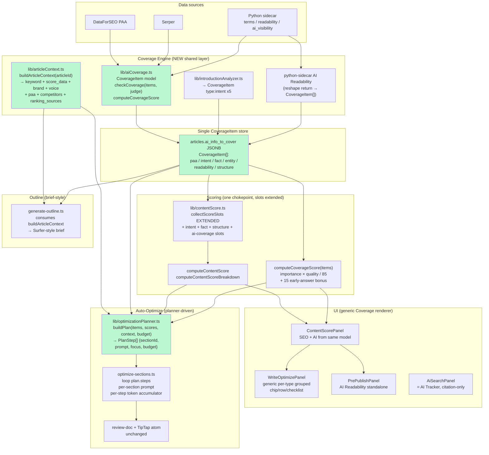

# Coverage-Engine Architecture Audit

**Date:** 2026-06-30
**Branch:** `feature/gsap-motion-polish`
**Scope:** Read-only architecture audit answering the central question below.
**Method:** 4 parallel `Plan` subagents (read-only) for sections 1–7, single-author synthesis for sections 8–10. All findings cite `file:line`.

---

## Central question

> Can the current architecture support a single shared **Coverage Engine** that powers SEO Score, AI Search, Content Score, Auto-Optimize, Outline, and AI Readability?

**TL;DR — PARTIALLY, with a clear forward path.** The codebase already has every load-bearing seam a Coverage Engine needs (a unified scoring chokepoint at `collectScoreSlots`, a stable section model, a CoverageItem-shaped DB table that is currently shadow data, an SSE Auto-Optimize loop that is one parameter away from being planner-driven, and a Pre-Publish surface that already hosts a standalone LLM rubric). What it does **not** have is the **shared `CoverageItem` model itself**: today the same concept ("information to add") is reified in 5+ disjoint shapes across 5+ persistence layers, each feature rebuilds its own context, and there is **no decision layer** between recommendations and the LLM in Auto-Optimize. The good news is that none of these are deep architectural debts — they are missing wiring, not missing foundations. Detailed verdicts and a refactor map follow.

---

## 1. Content Score / Scoring Pipeline

### Findings

**There is exactly ONE `computeContentScore()` definition** at `lib/contentScore.ts:375-400`, fed by a single slot collector `collectScoreSlots()` at `lib/contentScore.ts:302-373`. Per-slot gaps come from `computeContentScoreBreakdown()` at `lib/contentScore.ts:406-423` reading the same `collectScoreSlots()` (lib/contentScore.ts:300-301 comment: *"Single source of truth for every scoring slot — both `computeContentScore` (sum) and `computeContentScoreBreakdown` (per-slot gaps) read from this so they can never diverge."*).

Slots and weights (`lib/contentScore.ts:319-372`): `words(20)`, `headings(10)`, `terms(25)`, `paragraphs(5)`, `kwPlacement(15)`, `readability(10)`, `externalLinks(5)`, `title(7)`, `meta(5)`, `imageAlt(4)`, `lists(3)`, `faq(10)`, `kwCoverage(10)`. The reserved-points denominator pattern (`possible = slots.reduce…` at line 390) is robust to missing inputs.

**The "Content Score" centre gauge is NOT a model-level blend.** `lib/contentScore.ts` knows nothing about AI. The blend lives in the view layer only:
- `components/articles/ScoreTrio.tsx:50` — `const overall = hasAi ? Math.round((seo + ai) / 2) : seo;` — a flat 50/50 average inside a React component.
- `components/articles/ContentScorePanel.tsx:582-583` calls `computeAiSearchScore(aiVisibilitySummary)` and forwards both numbers into `ScoreTrio`.

`computeAiSearchScore()` (`lib/aiSearchScore.ts:19-31`) is a purely citation-shaped formula:
```
citationScore        = ownCitationRate * 45   // prompts_cited / prompts_total
shareScore           = (1 - competitorPressure) * 25
extractabilityScore  = extractability * 30    // /100 → /1
```
It needs only `AiVisibilitySummary` (`lib/aiSearchScore.ts:11-17`). The `citations[].answer_readiness_score` is filled by string-overlap of PAA question words vs. body text in `lib/seo/keywordData.ts:189-207` — no LLM judge.

### Dependency map

| File | Computes | Consumers |
|---|---|---|
| `lib/contentScore.ts` (`computeContentScore`, `computeContentScoreBreakdown`, `collectScoreSlots`) | 0–100 SEO/content score from HTML + NLP terms + keyword | `pages/articles/[id]/index.tsx:730, 787, 1146`; `components/articles/ContentScorePanel.tsx:340, 507`; `pages/api/articles/deep-analysis.ts:406`; `pages/api/articles/import.ts:334`; `pages/api/articles/[id]/debug-export.ts:50-51` |
| `lib/aiSearchScore.ts` (`computeAiSearchScore`) | 0–100 citation-rate score from `AiVisibilitySummary` | `lib/aiVisibilityStore.ts:14`; `pages/api/articles/ai-visibility.ts:87`; `lib/ai/tools.ts:213, 240`; `components/articles/ContentScorePanel.tsx:525, 566, 583` |
| `lib/seo/keywordData.ts:171-220` (`getAiSearchInfo`) | `AiVisibilitySummary` from DataForSEO PAA + token-overlap "covered" check | `pages/api/articles/deep-analysis.ts:473` (initial fill) |
| `components/articles/ScoreTrio.tsx:50` (`overall = (seo+ai)/2`) | Centre "Content Score" displayed value (UI only — never persisted) | `ContentScorePanel`, `WriteOptimizePanel` |
| `lib/optimizeSectionEdit.ts:14-24` (`computeMissingTerms`) | Article-wide unmet NLP terms list (feeds Auto-Optimize per-section prompt) | `pages/api/articles/optimize-sections.ts:100` |
| `lib/ai/tools.ts:213, 240` (`get_ai_search_score`) | Surfy chat tool answers about score | `pages/api/articles/ask-surfy.ts` |

### Verdict

The SEO/content scoring pipeline is genuinely **unified at a single entry point** (`collectScoreSlots` → `computeContentScore`/`computeContentScoreBreakdown`) and every consumer reads through it — refactoring it is safe. The "Content Score" centre gauge however is a hard-coded `(seo + ai) / 2` in `ScoreTrio.tsx:50` and `aiSearchScore.ts` is a completely parallel pipeline keyed on `AiVisibilitySummary` rather than coverage items — **the blend exists in the view, not the model**. Moving AI Search to a coverage-based formula is moderate-effort: `computeAiSearchScore` can be replaced (or made to delegate) without touching any of the eight downstream call sites as long as the new function still consumes an `AiVisibilitySummary`-shaped object. The cleanest long-term move is to extend `collectScoreSlots` with new slot keys (`intent`, `fact`, `expectation`, `structure`) that read from a unified `CoverageItem[]` carried alongside `ScoreData.terms`, keeping the slot collector as the single source of truth for BOTH bars.

---

## 2. SEO Guidelines

### Findings

Guidelines are not a unified entity today — they are scattered across three parallel "info to cover" producers:

1. **NLP terms** (`scoreData.terms: NlpTerm[]`) — competitor-extracted phrases, the SEO guideline list. Generated by the Python sidecar (`extract_semantic_terms` / `extract_terms`), surfaced at `pages/api/articles/deep-analysis.ts:131` (`const terms: any[] = serp.terms || [];`) and `:367-377`. Deep-analysis explicitly avoids layering DataForSEO keyword ideas on top (`deep-analysis.ts:126-130` comment).
2. **PAA questions** (`scoreData.paa_questions: string[]`) — produced by Serper inside the sidecar, merged into `scoreData` at `pages/api/articles/deep-analysis.ts:50`. Consumed by `_faqCoverage()` (`lib/contentScore.ts:187-210`).
3. **AI Search "info to cover"** (`AiVisibilitySummary.citations[]`) — two sources:
   - **DataForSEO People Also Ask** in `lib/seo/keywordData.ts:171-220` (`getAiSearchInfo`). Coverage is naive string overlap (`keywordData.ts:189-196`), readiness 0–100, "covered" when `≥60`.
   - **Sidecar LLM judge** (`callSidecar('/ai-visibility')` in `pages/api/articles/ai-visibility.ts:74` and `lib/ai/tools.ts:225`) — populates `extractability_score` and `citations` with real LLM responses.

**Five separate persistence layers feed guidelines:**
- `articles.score_data` (TEXT JSON) — `lib/ensureArticlesTables.ts:49` — carries `terms[]` and `paa_questions[]`. The only one currently read by the editor's live gauge (`pages/articles/[id]/index.tsx:611-613`).
- `article_terms` table — `lib/ensureArticlesTables.ts:106-118` — **already exists** with the right shape: `term_type TEXT DEFAULT 'topic'`, `source TEXT DEFAULT 'serp'`, `importance REAL DEFAULT 0`, `target_min/target_max`. Written at `pages/api/articles/deep-analysis.ts:457-465` but **never read by the live scoring path** — currently shadow data.
- `article_competitors.terms_json` / `entities_json` (`lib/ensureArticlesTables.ts:86-87`) — per-competitor extracted terms.
- `ai_visibility_runs.summary_json` + `ai_visibility_citations` (`lib/ensureArticlesTables.ts:121-147`) — the AI Search guideline list.
- `article_keywords` table — `lib/ensureArticlesTables.ts:161-177` — target keywords with `is_covered`, `gsc_position`, `source` (`'gsc' | 'ads_suggestion' | 'manual' | 'gap'`).

**UI grouping is hand-rolled per type.** `WriteOptimizePanel.tsx` renders chips for NLP terms (`TermChip`, line 151), per-prompt rows for AI Search (`buildInfoToCover`, line 46-56), and a **hard-coded "Upfront Intent Alignment" card with four literal strings** (`WriteOptimizePanel.tsx:473-481`) where `intentCovered = (aiSummary?.extractability_score ?? 0) >= 55 || wordCount > 400` (`WriteOptimizePanel.tsx:272`). The intent guideline is a UI placeholder with no real per-item coverage detection.

### Current guideline shapes

```ts
// lib/contentScore.ts:12-16  — the SEO "terms" chips
interface NlpTerm { term: string; target_count: number; current_count?: number; }

// lib/articleTerms.ts:27-32  — the DB-backed version, NOT used at runtime by the editor
type ArticleTerm = {
  term: string; target_count: number; current_count?: number;
  term_type?: 'keyword' | 'topic' | 'entity' | 'question';
}

// lib/ensureArticlesTables.ts:106-118  — already-richer DB columns, currently shadow data
// article_terms { term_type TEXT, source TEXT, importance REAL,
//                 target_min INT, target_max INT, current_count INT }

// lib/contentScore.ts:32  — PAA questions, flat strings on scoreData
paa_questions?: string[];

// lib/aiSearchScore.ts:1-9  — AI Search "info to cover" rows
type AiCitation = {
  prompt: string; answer?: string; cited_url?: string; cited_domain?: string;
  is_own_domain?: boolean; is_competitor?: boolean;
  answer_readiness_score?: number;  // 0-100 → covered when ≥60
};

// components/articles/WriteOptimizePanel.tsx:45  — UI projection of AiCitation
type InfoItem = { prompt: string; covered: boolean; domains: string[] };

// article_keywords  — target keyword coverage rows
type ArticleKeyword = {
  id: number; keyword: string; is_covered: boolean;
  gsc_position?: number; ads_monthly_volume?: number; ads_competition?: string;
  source: 'gsc' | 'ads_suggestion' | 'manual' | 'gap';
}

// components/articles/PrePublishPanel.tsx:88-89  — readability criteria
type AiReadabilityCriterion = { key: string; met: boolean; note?: string; suggestions?: string[] };
type AiReadabilityResult    = { score: number; criteria: AiReadabilityCriterion[] };

// Hard-coded "Intent" guidelines — components/articles/WriteOptimizePanel.tsx:476-481
// Literal strings, single shared `intentCovered` boolean, no per-item coverage.
```

### Verdict

Guidelines are generated by **three different upstreams** and persisted in **five different shapes**. Adding a new guideline type today means extending NlpTerm/ArticleTerm, one of the sidecar endpoints, a new slot in `collectScoreSlots()`, and new UI in `WriteOptimizePanel` — the literal-JSX "Upfront Intent Alignment" card is the smoking gun. **The good news:** the `article_terms` DB table is already shape-compatible with the target `CoverageItem` (`term_type`, `source`, `importance`, per-item counts), and `collectScoreSlots()` is a single chokepoint — wiring `CoverageItem[]` through `scoreData` and replacing per-type UI clusters with a generic Coverage renderer is a **few-day refactor**, not a rewrite.

---

## 3. AI Search

### Shipped vs Planned

- **PLANNED ONLY.** The coverage-based AI Search described in `docs/superpowers/specs/2026-06-30-ai-search-coverage-model-design.md` and `docs/superpowers/plans/2026-06-30-ai-search-coverage-model.md` is **not implemented**. `lib/aiCoverage.ts` does **not exist** (grep for `CoverageItem|aiCoverage|CoverageJudge|checkCoverage|computeCoverageScore` only hits the two design docs).
- **SHIPPED today:** AI Search in the editor is a **citation / answer-readiness** model — PAA-driven heuristic computed by token-overlap in `lib/seo/keywordData.ts::getAiSearchInfo`, scored by `lib/aiSearchScore.ts::computeAiSearchScore` (45% own-citation rate + 25% competitor pressure + 30% extractability).
- **The "split editor score vs AI Tracker"** the spec promises is **not done**: the same `aiSearchScore.ts` still feeds the editor gauge (`ContentScorePanel.tsx:583, 566, 525`).

### Findings

- `lib/aiSearchScore.ts:19-31` — pure score from `AiVisibilitySummary`. Inputs: `prompts_total`, `prompts_cited`, `competitor_citations`, `extractability_score`. No coverage / quality / LLM judge.
- `lib/seo/keywordData.ts:192-211` — `getAiSearchInfo()` builds the summary heuristically from DataForSEO PAA:
  ```
  192   const citations = paa.questions.map((q) => {
  193      const words = q.question.toLowerCase()...filter((w) => w.length >= 4 && !AI_STOP.has(w));
  196      const readiness = words.length ? Math.round((matched / words.length) * 100) : 0;
  ...
  209   const cited = citations.filter((c) => c.answer_readiness_score >= 60).length;
  211   const extractability = Math.round(citations.reduce((s, c) => s + c.answer_readiness_score, 0) / citations.length);
  ```
- `python-sidecar/analyzers/ai_visibility.py:14-60` — alternative source: hard-coded 5 Polish prompts + token-overlap scoring. Same family — keyword match, not coverage of knowledge items.
- `pages/api/articles/ai-visibility.ts:74-90` — POST handler calls sidecar `/ai-visibility`, persists via `persistAiVisibilityRun`, returns the summary with `computeAiSearchScore` re-applied.
- `pages/api/articles/deep-analysis.ts:467-492` — during deep-analysis the same `AiVisibilitySummary` is filled (DataForSEO first, sidecar fallback) and persisted. No CoverageItem/quality storage.
- `lib/aiVisibilityStore.ts:9-68` — persists to `ai_visibility_runs` + `ai_visibility_citations`. **No `ai_info_to_cover` JSON column on `articles`** (the planned column from spec/plan Task 5).
- `pages/articles/[id]/index.tsx:60, 465, 614-615, 944, 1971` — editor pulls `art.ai_visibility_summary` and passes it through state to `ContentScorePanel`. No second AI score path.
- `components/articles/ContentScorePanel.tsx:582-583`:
  ```
  const hasAi = !!(aiVisibilitySummary && aiVisibilitySummary.prompts_total > 0);
  const aiScore = hasAi ? computeAiSearchScore(aiVisibilitySummary) : 0;
  ```
- `components/articles/AiSearchPanel.tsx:42-54` — standalone panel renders citations with `answer_readiness_score`. Citation-based UI.
- `components/articles/WriteOptimizePanel.tsx:46-56` — `buildInfoToCover(summary)` derives the AI checklist from `summary.citations`; "covered" = `answer_readiness_score >= 60`. No quality grade, no `missing[]`.

### Coverage-based AI Search integration points

Because the editor already speaks a single `AiVisibilitySummary` shape end-to-end, swapping the source is mechanical:

1. **Compute + persist** — `pages/api/articles/deep-analysis.ts:467-492` (existing AI-search persist block). Insert `paaCoverageItems(paa.questions)` + `intentItems()`, run `checkCoverage()`, compute `aiCoverageScore`, store `ai_info_to_cover` (new JSONB column added to `lib/ensureArticlesTables.ts`).
2. **Article API load** — `pages/articles/[id]/index.tsx:614-615` (where `art.ai_visibility_summary` is hydrated). Add parallel `setAiCoverage(art.ai_info_to_cover)` + `setAiCoverageScore(...)`.
3. **Pass to panel** — `pages/articles/[id]/index.tsx:1971` (`<ContentScorePanel ... aiVisibilitySummary={aiVisibilitySummary} />`). Add `aiCoverageScore` + `coverageItems`.
4. **Display swap** — `components/articles/ContentScorePanel.tsx:583` (editor gauge), `:525` (WriteOptimizePanel `ai` prop), `:566` (PrePublishPanel `aiScore` prop). Replace with `aiCoverageScore ?? computeAiSearchScore(...)`.
5. **AI-list redirect** — `components/articles/WriteOptimizePanel.tsx:46-56` (`buildInfoToCover`) + `:473-481` (Upfront Intent Alignment + Information to cover cards). Consume `coverageItems` instead of `summary.citations`, so quality + `missing[]` surface in the UI.
6. **Migration / AI Tracker** — `lib/aiSearchScore.ts` and `lib/aiVisibilityStore.ts` remain untouched; `AiSearchPanel.tsx` continues to serve the "AI Tracker" view.

### Verdict

The architecture is well-positioned: one `AiVisibilitySummary` shape flowing through one storage path and three UI sites, so swapping the source from `computeAiSearchScore(summary)` to `aiCoverageScore` is ~5 lines across 2 files. However, **nothing of the coverage model has shipped** — no `lib/aiCoverage.ts`, no `ai_info_to_cover` column, no LLM judge, no quality grade, no `missing[]`. Today's AI Search is keyword/token-overlap over PAA; the editor/Tracker split is not yet in code.

---

## 4. Intro / Intent Alignment

### Findings

- **No code analyzes the introduction independently.** `lib/articleSections.ts:30-88` (`splitSections`) marks the pre-first-`<h2>` block as section 0 with `headingText: ''`, but no consumer slices it back out. Grep for `sections\[0\]|isIntro|index === 0` returned zero hits inside coverage/scoring code; `splitSections` is consumed only by `pages/api/articles/optimize-sections.ts:96` which iterates uniformly.
- **No "main question" or first-paragraph extraction in scoring.** No `intro|firstParagraph|lead|opening|main.question|first 500` references in `lib/contentScore.ts` or `optimize-sections.ts`.
- **The only "intent alignment" UI is hard-coded boolean theater.** `components/articles/WriteOptimizePanel.tsx:272`:
  ```
  const intentCovered = (aiSummary?.extractability_score ?? 0) >= 55 || wordCount > 400;
  ```
  Applied identically to all 4 intent items at `:476-479` ("Answer the main question", "Set expectations", "Identify who it's for", "Explain why it matters"). Length/extractability heuristic, not real intent analysis.
- **The closest existing intent signal lives in the AI Readability rubric (sidecar, off the critical path):**
  - `python-sidecar/analyzers/ai_readability.py:13-15`:
    ```
    ("introduction", "Introduction Section", "Clear, dedicated introduction that sets expectations..."),
    ("early_query", "Early Query Confirmation", "Target query and core topic are clearly addressed within the first paragraph..."),
    ("search_intent", "Search Intent Alignment", "Content directly addresses the implied search intent..."),
    ```
  - Mirror constants in `components/articles/PrePublishPanel.tsx:97-98`.
  - Behind a manual "Analyze Content" button (`pages/api/articles/ai-readability.ts:42`), persists only to `ai_readability_json`, feeds the pre-publish modal — NOT the AI Search gauge or Auto-Optimize.
- **No detection of the article's "main question"** anywhere in shipped code. Closest proxy is `target_keyword`. `answersMainQuestion`/`answersMainQuestionEarly` exists **only** in the design/plan docs.
- **`splitSections` already gives a stable handle for an analyzer.** `lib/articleSections.ts:62-71` produces section 0 with deterministic `sectionId('', 0)`.

### IntroductionAnalyzer plug-in assessment

- **Inputs available without refactor:** `plainText`/`editorHtml` already in `pages/articles/[id]/index.tsx:470-471`; `target_keyword` on the article; `splitSections(html)[0]` for the intro block; deepseek-chat HTTP pattern reusable from `optimize-sections.ts:113-120`.
- **Where its output would feed:**
  1. **As CoverageItems** of `type: 'intent'` (`importance: 'critical'` for `intent-answer-main` / `intent-early-answer`, `'recommended'` for the rest). The planned `intentItems()` slot in `lib/aiCoverage.ts` accepts exactly this shape.
  2. **As the +15 early-answer bonus.** The spec's `answersMainQuestionEarly` (`docs/superpowers/specs/2026-06-30-ai-search-coverage-model-design.md:99-103`) is literally `answerStartsEarly`.
  3. **As a replacement for the fake `intentCovered`** at `WriteOptimizePanel.tsx:272`. Per-item booleans replace the OR-heuristic; the card UI at `:473-481` already supports per-item `covered` — no UI change.
  4. **As input to Auto-Optimize.** Failures populate `missing[]` for section 0, enabling intro-targeted rewrites.
- **Refactor risk: very low.** Purely additive new module (`lib/introductionAnalyzer.ts`) called from `pages/api/articles/deep-analysis.ts:473-475` beside `getAiSearchInfo`. No changes to `splitSections`, `optimize-sections.ts`, or editor state.

### Verdict

The codebase has **no real introduction-aware analysis today** — `splitSections` exposes section 0 but no scorer or judge consumes it; the visible "Upfront Intent Alignment" UI is a single derived boolean repeated four times. The only LLM-graded intro/intent signal lives in the off-path AI Readability rubric. An `IntroductionAnalyzer` is genuinely additive — `splitSections` already isolates the intro, the deepseek call pattern exists, and the planned `CoverageItem` model has `type: 'intent'` slots ready — so it plugs in without refactor, ideally alongside (or after) `lib/aiCoverage.ts`.

---

## 5. AI Readability

### Current readability signals

**Deterministic (TypeScript):**
- `lib/contentScore.ts:167-180` — `_readability(html)`: avg words-per-`<p>` (target 40–100), 0–10 points. **The only readability signal that feeds Content Score today.**
- `lib/contentScore.ts:191-209` — `_faqCoverage(html, paa_questions)`: PAA-coverage via heading match (≥60%) or body word overlap (≥70%).
- `lib/contentScore.ts:216-222` — `_externalLinks`: external `href` count tiered 0/2/5/3.
- `lib/contentScore.ts:231-243` — `_titleQuality`: `<title>` presence + 50–60 char length + keyword.
- `lib/contentScore.ts:251-263` — `_metaDescQuality`: 140–165 chars + keyword.
- `lib/contentScore.ts:270-281` — `_imageAltCoverage`: ratio of `` with `alt`.
- `lib/contentScore.ts:287-294` — `_listUsage`: number of substantial `<ul>/<ol>` (≥3 `<li>`).
- `lib/contentScore.ts:146-161` — `_kwPlacement`: H1 / H2 / first-100-words keyword presence.
- `lib/contentScore.ts:319-340` — slot pushes for `words`, `headings`, `paragraphs` vs targets.
- `components/articles/ArticleEditor.tsx:1396-1414` — `calcAndEmit`: live counts from Tiptap.
- `components/articles/ContentScorePanel.tsx:313-315` — second derivation of `paragraphCount` from `plainText.split(/\n\n+/)` (duplicates the Tiptap-based count above).
- `components/articles/ContentScorePanel.tsx:773-777` — "Structure metrics" footer.

**Flesch–Kincaid (UI-only, not in score):**
- `components/articles/PrePublishPanel.tsx:37-54` — `countSyllables` + `readability(text)` → FK grade & raw score, displayed only.

**LLM rubric (Python sidecar, already a distinct module):**
- `python-sidecar/analyzers/ai_readability.py:12-23` — 10 criteria (`introduction`, `early_query`, `search_intent`, `concept_clarity`, `progression`, `inter_section`, `self_sufficiency`, `top_headings`, `subheadings`, `info_density`) with met/note/suggestions; 0–100 score from met-count ratio (line 91).
- `python-sidecar/analyzers/ai_readability.py:95-136` — `apply_ai_readability` rewrites HTML applying structure-only suggestions.
- `pages/api/articles/ai-readability.ts` — POST endpoint, persists in `articles.ai_readability_json`.
- `pages/api/articles/apply-readability.ts` — POST endpoint calling sidecar `/apply-ai-readability`.

**Critical decoupling — already done.** Comment at `PrePublishPanel.tsx:171-173`:
> *"'Analyze Content' runs ONLY the AI Readability rubric — it must never touch the AI Search score (that's driven by the separate ai-visibility analysis)."*

### Existing pre-publish surfaces

- `components/articles/PrePublishPanel.tsx` — already named "Pre-Publish Review" (`:241`). Hosts Readability (FK), Plagiarism Check, AI Readability rubric. Natural home for the module.
- `components/articles/PlagiarismPanel.tsx` — sibling pre-publish surface, swapped in/out by `PrePublishPanel:213-227`.
- "Apply All" handoff to optimize pipeline at `:353-360` already exists.

### Standalone-module refactor assessment

**Carves out cleanly:**
- The 10-criterion LLM rubric (`python-sidecar/analyzers/ai_readability.py`) is already standalone — own endpoint, own persistence column, own apply step. Not entangled with Content Score.
- The PrePublishPanel UI block at `:301-383` is self-contained: own analyze/re-analyze loop, never writes to SEO/AI Search scores, own Apply-All handoff.
- The 10 criteria map cleanly to `CoverageItem.type = 'readability' | 'structure'` with `quality 0–5` derived from `met`+note severity, `needsExpansion` from criterion gravity, `sectionId?` when criterion is section-scoped.

**Duplicates needing reconciliation:**
- `_readability` (paragraph length) in `contentScore.ts:167-180` overlaps `info_density` / `subheadings` in the LLM rubric.
- `paragraphCount` computed two ways (Tiptap JSON vs `\n\n+` split).
- `wordCount`/`headingCount`/`paragraphCount` are state in `pages/articles/[id]/index.tsx:472-475` prop-drilled into `ContentScorePanel`.
- FK score in `PrePublishPanel.tsx:37-54` re-counts words/sentences/syllables.

**Effort estimate: 1–2 days.** Backend already separate (0 work to extract). UI already separate (~½ day to move into `AiReadabilityPanel`). ~½ day to standardize the criterion return into `CoverageItem[]`. ~½ day to consolidate duplicated counters.

### Verdict

AI Readability is already **~80% of the way to being a standalone module**: the LLM rubric, its API endpoints, its persistence column, and its UI block are all decoupled from the SEO/AI Search scores. Remaining work is reconciling duplicated deterministic counters (paragraphCount, FK score) and reshaping the criterion return into the unified `CoverageItem` schema — both small mechanical refactors. `PrePublishPanel` is the natural host.

---

## 6. Outline Generation

### Outline-generator inventory

There are **two distinct outline generators with no shared layer**:

1. **Standalone outline generator (UI-driven, "Research Outline"):**
   - UI: `components/articles/ResearchOutlinePanel.tsx:76-78, 102-120` (state + handler).
   - API: `pages/api/articles/generate-outline.ts:14-118` (DeepSeek `deepseek-chat`, max 1024 tokens).
   - Competitor feeder: `pages/api/articles/competitor-outlines.ts` (proxy to sidecar, cached at `articles.competitor_outlines_cache`).
   - Display helpers: `components/articles/CompetitorOutlinesPanel.tsx`, `components/articles/OutlinePanel.tsx`.
   - Client helpers (not API): `lib/researchUtils.ts:27-46, 53-80`.

2. **Inline outline phase inside article-body generation (sidecar pipeline):**
   - `python-sidecar/pipeline/article_pipeline.py:108-122` — "Faza 1: Outline" prompt inside `run_pipeline`, receives FULL context (site_context, serp_data, terms, target_words, brand_knowledge, voice_tone, instructions).
   - Triggered by: `pages/api/articles/[id]/generate.ts:86-91` (assembles `sidecarPayload` with brand_knowledge, voice_tone) and `pages/api/articles/generate.ts:76-82` (direct generate, no brand context).
   - Output is internal — consumed only by Faza 2 (article body) at `article_pipeline.py:124-144`; never returned as a brief.

### Context inputs (what each prompt receives today)

**(1) Standalone `/api/articles/generate-outline` — sparse:** Prompt at `pages/api/articles/generate-outline.ts:57-74` receives:
- `keyword` (`:19`)
- `competitors[]` with headings — sliced to 30/each (`:36-44`)
- `currentHeadings[]` ("do NOT repeat these") (`:53-55`)
- `avgHeadings` median (`:47-49`)
- `language` (`:51`)

**Explicitly NOT in this prompt** (grep verified, no matches):
- No `paa_questions` (despite being on `score_data` since `deep-analysis.ts:50`)
- No `terms` (NLP terms from `score_data.terms`)
- No `brand_knowledge`/`brandKnowledge` (exists in `lib/contentSettings.ts`, used by sidecar generator at `[id]/generate.ts:81`)
- No `voice_tone` (per-domain, via `lib/domainVoices.ts`)
- No AI-search citations (stored at `articles.ranking_sources.ai`)
- No `instructions`/custom rules, no `content_type`/`tone`, no entities.

**(2) Sidecar `article_pipeline.run_pipeline` outline phase — fuller context:** `python-sidecar/pipeline/article_pipeline.py:109-122` receives `keyword`, `type_guide`, `site_info`, `terms_str` (top-25 NLP terms), `target_words`, `serp_data.headings_target`, `language`, `brand_block` (line 92-95), `instr_block` (line 84-87). NOT receiving: `paa_questions`, `currentHeadings`, AI-search citations, voice_tone (Phase 2 only).

### Context builder pattern (is there one?)

**No — there is no shared "article-context builder" in Next.js.**

Evidence: grep for `articleContext|buildContext|buildArticleContext|buildPrompt` returns 0 matches in `pages/`, `lib/`, `components/`. Each feature rebuilds context independently from raw DB rows:
- **Generate Outline** (`generate-outline.ts:19-25`): receives `keyword` + `competitors` + `currentHeadings` from the client — no server-side enrichment.
- **Article body generation** (`[id]/generate.ts:79-91`): inlines `readContentSettings()` + `getDomainVoices(domainId)`.
- **AI Visibility** (`ai-visibility.ts`): pulls own ArticleRow + competitor domains.
- **Optimize Sections** (`optimize-sections.ts:24-39`): only `missingTerms` — no brand_knowledge, voice, PAA.
- **Deep Analysis** (`deep-analysis.ts:37-52`): produces `score_data` (terms, targets, paa_questions) but no downstream feature reads it back as a typed context object.

### Verdict

The standalone "Generate Outline" endpoint **cannot produce Surfer-style briefs today without architectural change** — its prompt only sees competitor outlines and current headings, ignoring PAA questions, NLP terms, brand knowledge, voice tone, content type, AI citations, and user instructions that already live on the article. A brief needs critical facts, intent, target entities, brand context, per-section directives; none are passed. There is no shared article-context builder — each of Outline, Auto-Optimize, AI Visibility, and the sidecar `run_pipeline` independently re-pulls and shapes its own slice. **Building `buildArticleContext(articleId)` is the unblocker — moderate effort (~2–3 days), no rewrites required**, and would simultaneously deepen the outline prompt, enable brief-style output, and serve as the foundation for the unified Coverage Engine.

---

## 7. Auto-Optimize (including Planner)

### File inventory

Server endpoint + libs:
- `pages/api/articles/optimize-sections.ts:1-161` — the sole Auto-Optimize endpoint (SSE, DeepSeek-chat)
- `lib/articleSections.ts:30-88` — `splitSections()` + stable `sectionId()` hash
- `lib/articleSections.ts:98-120` — `normalizeHtmlForDiff()`
- `lib/optimizeSectionEdit.ts:14-24` — `computeMissingTerms()`
- `lib/optimizeSectionEdit.ts:28-30, 37-39, 43-45` — `stripFences`, `isUsableEdit`, `shouldChargeCredit`
- `lib/optimizeSectionEvents.ts:4-30` — `SectionEvent` shape + `buildSectionEvent()`
- `lib/optimizeReviewDoc.ts:10-18` — `buildReviewDoc()`
- `lib/optimizeResolveAll.ts:26-35` — `collectOptimizerPositions()`
- `lib/aiTokenUsage.ts:7-8, 37-63` — org-wide 5h token budget, 500k tokens/window
- `lib/optimizeStats.ts:22-30` — post-run word delta presentation

Client orchestration + UI:
- `pages/articles/[id]/index.tsx:1132-1245` — `handleAutoOptimizeSections()` (SSE consumer + review-doc loading)
- `pages/articles/[id]/index.tsx:1247-1281, 1283-1336, 1341-1370, 1948-1955`
- `components/articles/optimizeStore.ts:1-18` — app-side per-section old/new HTML
- `components/articles/contentOptimizerNode.ts:9-48` — TipTap atom node
- `components/articles/ContentOptimizerNodeView.tsx:31-171` — NodeView with Accept/Reject
- `components/articles/OptimizeReviewBar.tsx`, `OptimizeResultsPanel.tsx:11-23`
- `components/articles/WriteOptimizePanel.tsx:1-56` — panel that KNOWS about `AiVisibilitySummary` but doesn't forward it
- `__tests__/api/articles-optimize-sections-guard.test.ts:1-50`

### Prompt assembly — step by step

Entirely lives in `pages/api/articles/optimize-sections.ts:23-39`:

1. Article-wide missing-terms computed ONCE per run (`optimize-sections.ts:100`):
   ```ts
   const missingTerms = computeMissingTerms(scoreData, content);
   const systemPrompt = buildSystemPrompt(missingTerms);
   ```
   Every section gets the SAME system prompt.

2. `buildSystemPrompt(missingTerms)` (`optimize-sections.ts:23-39`):
   ```
   You are an expert SEO content editor making MINIMAL, surgical edits to ONE section of an HTML article.
   RULES:
   - Apply MINIMAL surgical edits — refine, do not rewrite
   - Weave in these MISSING NLP terms VERBATIM where natural: "term1", "term2", ...
   - Tighten weak sentences and remove AI-sounding filler ...
   - Keep the SAME LANGUAGE as the input (auto-detect)
   - Preserve EVERY heading, <a> link, , and list EXACTLY
   - Do NOT remove or shorten existing sentences — only refine or expand
   - Keep each paragraph between ~40 and ~80 words
   OUTPUT: ONLY the section's raw HTML.
   ```

3. User message (`optimize-sections.ts:121-122`): `Improve this section:\n\n${section.html}`.

4. Loop iterates every section unconditionally (`optimize-sections.ts:106-146`), 1 call + up to 2 retries per section.

### Prompt inputs today (what the LLM receives)

- **SEO entities/terms (NLP terms):** YES — subset under ~70% target (`lib/optimizeSectionEdit.ts:14-24`), passed verbatim into every section's system prompt (`optimize-sections.ts:24-27`).
- **AI-search / coverage info:** **NO.** Grep over `optimize-sections.ts` for `aiVisibility|AiSearch|computeAiSearchScore` → zero hits. Endpoint signature accepts only `{ content, articleId, scoreData }` (`optimize-sections.ts:46-50`). `AiVisibilitySummary` is computed, persisted, and even available client-side in `WriteOptimizePanel` (`:29`), but client's `handleAutoOptimizeSections` deliberately sends only `content, articleId, scoreData` (`pages/articles/[id]/index.tsx:1167`). **The single biggest missing input for an AI-search planner.**
- **Brand voice / custom rules:** **NO.** Grep for `brandVoice|domainVoice` in `optimize-sections.ts` → zero hits. Brand voice IS plumbed through `pages/api/articles/[id]/generate.ts:13, 82-83` for first-draft generation, but NOT for optimize.
- **PAA questions / FAQ coverage:** **NO.** `scoreData.paa_questions` exists (`lib/contentScore.ts:33`), scored in `_faqCoverage()` (`lib/contentScore.ts:363`), never surfaced into the prompt.
- **Keyword placement / readability / external-links signals:** **NO.** `collectScoreSlots()` knows exactly what's deficient (`lib/contentScore.ts:302-373`); none reaches the prompt.
- **Target keyword (H1, first-100-words signal):** **NO.** `article.target_keyword` available at `pages/articles/[id]/index.tsx:1146` for pre-score, not forwarded.
- **Section-specific metadata:** **NO.** Same system prompt for every section; per-section `headingText`/`index` known (`lib/articleSections.ts:75`) but not injected.

Net: the prompt encodes ONE recommendation type (missing NLP terms) plus a hard-coded style checklist. SEO Score has ~12 signals; Auto-Optimize uses ONE.

### Section splitting strategy

`lib/articleSections.ts:30-88` — `splitSections(html)` walks top-level Cheerio nodes; every `<h2>` opens a new bucket (`:40-48`). Intro content before first `<h2>` becomes index 0 with empty `headingText` (`:62-71`). No paragraph cap, no smart segmenter, no H3 awareness — flat H2-delimited. IDs via `sectionId(headingText, index)` (`:14-21`): hash of `${index}|${headingText}` → `sec_<index>_<base36>`.

A 5,000-word article with 8 H2s → 8–9 LLM calls in series, regardless of which sections actually need work.

### **PLANNER ANALYSIS** (most important)

**Is there a decision layer today? NO.**

Hard evidence:
- Endpoint loops `for (const section of sections)` (`optimize-sections.ts:106`) and unconditionally calls the LLM for every section. No filter, no scoring, no prioritisation between section enumeration and the `fetch` to DeepSeek (`:113`).
- `computeMissingTerms()` (`lib/optimizeSectionEdit.ts:14-24`) is the only "decision" anywhere — and it decides at the TERM level (which terms to weave), not SECTION level (which sections to send) and not RECOMMENDATION-TYPE level (entities vs AI vs readability).
- System prompt computed ONCE (`optimize-sections.ts:100-101`) and reused — per-section steering impossible by construction.
- `collectScoreSlots()` already produces the exact data a planner needs (per-slot earned/max/hint at `lib/contentScore.ts:302-373`), and `computeContentScoreBreakdown()` exposes `missingPoints` (`:406-416`). None of this reaches the endpoint.
- `AiVisibilitySummary` is computed and the panel uses it (`WriteOptimizePanel.tsx:46-56`) but is never POSTed.
- The 5h org token budget (`lib/aiTokenUsage.ts:7, 37-52`) is a GLOBAL gate — cannot make per-recommendation tradeoffs.

So the answer to Surfer's planner question is: **Auto-Optimize today is "shove every section through one prompt with one knob (missing NLP terms)."** No "SEO is already strong → focus on AI", no "skip already-covered sections", no focus mode.

**PROPOSED `OptimizationPlanner` plug-in point:**

Natural seam between `splitSections()` and the section loop at `pages/api/articles/optimize-sections.ts:96-106`, right after the `meta` SSE event at `:97` and before `:99`'s `computeMissingTerms`:

```
After:  const sections = splitSections(content);        // line 96
Insert: const plan = await buildOptimizationPlan({
           sections, scoreData, aiSummary, coverageItems,
           brandVoice, paa, keyword, breakdown
        });
Before: for (const section of sections) {               // line 106
        →  for (const step of plan.steps) {              // {sectionId, prompt, focus, expectedScoreLift}
```

**Inputs (all already in the codebase, just not wired):**
- `computeContentScoreBreakdown()` per-slot earned/max/missingPoints (`lib/contentScore.ts:406`).
- `AiVisibilitySummary` (`lib/aiVisibilityStore.ts:9`) or planned `CoverageItem[]` from `ai_info_to_cover`.
- Per-section signals: `headingText`, `index`, `wordCount(section.html)`, `countOccurrences()` per term restricted to this section (`lib/contentScore.ts:60-73`).
- Brand voice (`lib/domainVoices.ts`) and custom rules (`lib/contentSettings.ts`) — currently only in `generate.ts`.

**Output:**
```ts
type PlanStep = {
  sectionId: string;
  systemPrompt: string;            // PER-SECTION, not one global
  focus: 'seo-terms' | 'ai-coverage' | 'readability' | 'expand' | 'skip';
  budgetTokens: number;
  recommendations: CoverageItem[];
};
type Plan = { steps: PlanStep[]; estimatedTokens: number; rationale: string };
```

**Decision rules to encode (mirroring Surfer):**
- **SEO ≥85, AI weak:** drop NLP-term injection, prompt focuses on answer-readiness + question coverage + entity-anchor sentences for cited prompts.
- **SEO weak, AI strong:** keep current term-injection but per-section weight terms by which already appear (per-section `countOccurrences`).
- **Already-covered sections:** mark `focus: 'skip'`; loop emits `changed: false` SSE event directly (saves ~3k tokens × N skipped × $/Mtoken).
- **Per-section assignment:** route AI-search prompts only to sections whose `headingText` semantically matches the uncovered prompt (heading↔prompt overlap or cosine-sim).
- **Budget-aware top-N:** when `getOrgUsage5h().used` is near cap, pick top-K by `missingPoints` impact.

Prompt change: today's `buildSystemPrompt(missingTerms)` → `buildSystemPrompt(plan.step)` — per-section prompt with focus token, rationale, targeted recommendation list. Retries, abort, SSE events, credit charging stay as-is.

### Credit gating

Two global layers:

1. **Pre-run hard gate** (`optimize-sections.ts:62-72`): `getOrgUsage5h(orgId)` (`lib/aiTokenUsage.ts:37-52`). If `usage.over` → HTTP 429 with `org_limit`. Binary.
2. **Post-run charge** (`optimize-sections.ts:150-152`):
   ```ts
   const creditDeducted = orgId != null && shouldChargeCredit(changedCount, aiTokens);
   if (creditDeducted) await recordAiTokens(orgId, aiTokens);
   ```
   With `shouldChargeCredit = changedCount > 0 && aiTokens > 0` (`lib/optimizeSectionEdit.ts:43-45`).

Cost properties:
- Aggregate tokens for the whole run, not per-section.
- "No changes ⇒ no credit" is all-or-nothing — cannot say "5 of 8 sections produced changes — charge 5/8."
- 5h budget is 500k tokens shared across Surfy + Auto-Optimize (`lib/aiTokenUsage.ts:7`).
- Tokens are spent BEFORE `shouldChargeCredit` decides — "free run" means the org gets work for free if every section happened to no-op.

**Implication for the planner:** cost-aware planning is a clean fit. The planner emits `estimatedTokens`, and the gate at `:67-72` becomes "if `usage.used + plan.estimatedTokens > limit` → trim plan or 429." Per-step `budgetTokens` enables "top-K highest-impact sections." This is the natural place to implement Surfer-style "shift focus to AI Search" — the planner can compare two candidate plans before either runs.

### Review/Accept flow

Review doc built from `SectionEvent`s. `lib/optimizeReviewDoc.ts:10-18`:
```ts
return events.map((e) => {
  if (!e.changed) return e.oldHtml;
  const status = firstChangedSeen ? 'pending' : 'active';
  firstChangedSeen = true;
  return `<div data-content-optimizer data-section-id="${escAttr(e.sectionId)}" data-index="${escAttr(e.index)}" data-status="${escAttr(status)}"></div>`;
}).join('\n');
```

Client loads it with autosave suspended (`pages/articles/[id]/index.tsx:1221-1225`). The TipTap `contentOptimizer` atom carries only `{sectionId, status, index}` (`components/articles/contentOptimizerNode.ts:11-13`); actual HTML lives in `optimizeStore` Map (`components/articles/optimizeStore.ts:1-18`). NodeView reads back (`ContentOptimizerNodeView.tsx:36-38`) and splices on Accept/Reject (`:44-55`):
```ts
const splice = (html: string) => {
  const pos = getPos();
  editor.chain().focus()
    .insertContentAt({ from: pos, to: pos + node.nodeSize }, html).run();
};
const handleAccept = () => splice(newHtml);
const handleReject = () => splice(oldHtml);
```

Polling effect (`pages/articles/[id]/index.tsx:1252-1281`) counts remaining optimizer atoms; when 0 → re-enable autosave. Accept-all walks doc DESCENDING by pos (`:1288-1302`). Cancel restores `preReviewHtmlRef` (`:1322-1336`). **No undo-after-accept** — once spliced, the atom is gone; re-running optimize is the only "undo."

### Section state (id stability)

`sectionId(headingText, index)` (`lib/articleSections.ts:14-21`): stable IFF both inputs stable. Renaming an H2 → ID changes. Inserting a section before others → all subsequent IDs change (positional). Cross-run mapping is fragile.

For the planner: cross-run memory must key off `(articleId, normalizedHeading, position-near)`, not raw `sectionId`.

### Verdict

Auto-Optimize is **structurally close** to a Coverage-Engine-driven planner, but the prompt-assembly layer is the wrong shape. The section loop is a clean per-section dispatcher; LLM call site, retries, abort handling, SSE events, and credit charging are well-factored at `optimize-sections.ts:106-152` and need no change. The wrong shape: system prompt built ONCE before the loop with one input (missing NLP terms) — no per-section steering, no skip, no focus mode (SEO vs AI), and the endpoint doesn't even receive the inputs a planner would need. All those inputs exist elsewhere (`contentScore.ts:302-373`, `aiVisibilityStore.ts`, `domainVoices.ts`) and just need to be wired in. **Refactor effort: Medium** — add `aiSummary`/`brandVoice`/`paa`/`keyword`/`breakdown` to request body, introduce `buildPlan()` at line 96, replace `buildSystemPrompt(missingTerms)` at line 101 with a per-step builder, shift `recordAiTokens` to per-step accumulator. No changes to the review-doc/Accept-Reject layer or TipTap atom.

---

## 8. Knowledge model

### Does a reusable model exist? — No. There are **at least seven** disjoint shapes representing the same conceptual entity ("a thing the article should cover").

| # | Shape | File | Persistence | What it represents |
|---|---|---|---|---|
| 1 | `NlpTerm` `{ term, target_count, current_count? }` | `lib/contentScore.ts:12-16` | `articles.score_data` JSON (`lib/ensureArticlesTables.ts:49`) | SEO term — sidecar-extracted phrase to weave in |
| 2 | `ArticleTerm` `{ term, target_count, current_count?, term_type?: 'keyword'\|'topic'\|'entity'\|'question' }` | `lib/articleTerms.ts:27-32` | `article_terms` table (`lib/ensureArticlesTables.ts:106-118`, columns: `term_type, source, importance, target_min/max, current_count`) | Same as NlpTerm but richer + DB-shaped. **Shadow data — not read at runtime.** |
| 3 | `paa_questions: string[]` | `lib/contentScore.ts:32` | `articles.score_data` JSON | PAA — flat strings, no per-item coverage state |
| 4 | `AiCitation` `{ prompt, answer?, cited_url?, cited_domain?, is_own_domain?, is_competitor?, answer_readiness_score? }` | `lib/aiSearchScore.ts:1-9` | `ai_visibility_runs.summary_json` + `ai_visibility_citations` (`lib/ensureArticlesTables.ts:121-147`) | AI Search "info to cover" row — citation-shaped |
| 5 | `InfoItem` `{ prompt, covered, domains }` | `components/articles/WriteOptimizePanel.tsx:45` | None (UI derivation from #4) | UI projection of `AiCitation` |
| 6 | `ArticleKeyword` `{ id, keyword, is_covered, gsc_position?, ads_*, source: 'gsc'\|'ads_suggestion'\|'manual'\|'gap' }` | `article_keywords` table (`lib/ensureArticlesTables.ts:161-177`) | DB | Target keyword — coverage tracked |
| 7 | `AiReadabilityCriterion` `{ key, met, note?, suggestions? }` | `components/articles/PrePublishPanel.tsx:88-89` (mirror of `python-sidecar/analyzers/ai_readability.py:12-23`) | `articles.ai_readability_json` | 10 readability criteria — has `met` + `suggestions` (≈ `missing[]`) |
| (8) | Literal-JSX intent items | `components/articles/WriteOptimizePanel.tsx:476-481` | None — hard-coded | 4 "intent alignment" items with one shared boolean |

**Each model has its own coverage rule:**
- `NlpTerm` covered when `countOccurrences(term, body) >= target_count` (`lib/contentScore.ts:_termsCoverage`)
- `AiCitation` covered when `answer_readiness_score >= 60` (`components/articles/WriteOptimizePanel.tsx:46-56`)
- `paa_questions` covered when heading match ≥60% or body overlap ≥70% (`lib/contentScore.ts:191-209`)
- "Intent" covered when `extractability_score >= 55 || wordCount > 400` (`components/articles/WriteOptimizePanel.tsx:272`)
- `ArticleKeyword` covered when `is_covered` boolean (set elsewhere)
- `AiReadabilityCriterion` covered when `met` boolean

**None of them carry `quality 0–5`, `needsExpansion`, `missing[]`, or `sectionId`.**

### Merge into one `CoverageItem` — feasibility

```ts
interface CoverageItem {
  id: string;                                   // stable: `${type}-${hash(label)}`
  label: string;                                 // "Explain when to use Hooks" / "What is X?" / "covers cold-storage"
  type:        // ← absorbs all 7 shapes
    | 'paa' | 'intent' | 'fact' | 'definition' | 'comparison'
    | 'example' | 'warning' | 'entity' | 'process'
    | 'statistic' | 'expectation' | 'structure' | 'readability';
  importance: 'critical' | 'recommended' | 'optional';
  source:     'serp' | 'competitors' | 'paa' | 'llm' | 'manual';
  covered: boolean;
  quality: number;          // 0..5 (judged; bare mention = 1, thorough = 5)
  needsExpansion?: boolean;
  missing?: string[];       // specifics still absent → feeds OptimizationPlanner
  sectionId?: string;
}
```

| Existing shape | Maps to | Migration |
|---|---|---|
| `NlpTerm` | `type: 'entity'` (or `'fact'` when term reads as a fact), `source: 'serp'`, `quality` = ratio current/target × 5 capped 5 | Read `article_terms` (already in DB) — no new column needed |
| `ArticleTerm` | Direct — `term_type` → `type`, `source` already matches, `importance` already a column | **Already a 1:1 fit** with the DB table |
| `paa_questions[]` | `type: 'paa'`, `importance: 'recommended'`, `source: 'paa'`, stable `paa-${hashId(question)}` | Map at deep-analysis time (`pages/api/articles/deep-analysis.ts:467-492`) |
| `AiCitation` | `type: 'paa'` or `'intent'`, quality from `answer_readiness_score`/5 (rough mapping until LLM judge lands), `source: 'paa'` or `'llm'` | Replace in `WriteOptimizePanel.buildInfoToCover` and `ContentScorePanel:583` |
| `ArticleKeyword` | `type: 'entity'`, `importance: 'critical'` if `source === 'gsc'`, `'recommended'` if `'ads_suggestion'` | Already DB-shaped |
| `AiReadabilityCriterion` | `type: 'readability'`, `quality` = `met ? 5 : 0`, `missing = suggestions`, `importance: 'recommended'` | Reshape in `python-sidecar/analyzers/ai_readability.py:91` |
| Hard-coded intent items | `type: 'intent'`, 4 fixed (`intent-answer-main` critical, others recommended) — produced by `IntroductionAnalyzer` | Replace literal-JSX with a per-item map over `CoverageItem[]` |

**Verdict — the unification is structurally available, not architecturally blocked.** The `article_terms` table is **already** a CoverageItem-shaped column set; `score_data.terms` is the only shape that needs a non-DB extension (add `quality`, `missing`, `sectionId` fields). The `ai_info_to_cover` JSONB column proposed by the existing spec is the right addition. The 5+ disjoint shapes can collapse to one `CoverageItem[]` carried alongside `ScoreData.terms` with no schema rewrite — just a single new JSON column and reads through one `getCoverageItems(articleId): CoverageItem[]` helper.

---

## 9. Extensibility (Low / Medium / High to introduce)

Refactor cost defined as: code edits + new DB columns + new endpoints + UI ripple, on top of the existing branch state.

| Capability | Cost | Why |
|---|---|---|
| **Intent Alignment** | **Low–Medium** | `splitSections()[0]` already exposes the intro. Need: `lib/introductionAnalyzer.ts` (deepseek-chat one-shot) + 4–5 fixed `CoverageItem` rows + replacement of the literal-JSX intent card. Wires alongside `getAiSearchInfo` in `deep-analysis.ts:473-475`. No new DB column if stored inside `ai_info_to_cover`. |
| **AI Search Guidelines** | **Low** | Data path already plumbed end-to-end (`AiVisibilitySummary` flows through one state into 3 UI sites). Need: `lib/aiCoverage.ts` + `ai_info_to_cover` JSONB column + 5-line UI swap in `ContentScorePanel.tsx:583/525/566`. Plan exists, not executed. |
| **Facts** | **Medium** | `ArticleTerm.term_type` already accepts `'entity'` and `article_terms` table already accepts `term_type`/`source`/`importance`. Need: sidecar emit `fact`-typed items + UI group ("Critical facts" card in `WriteOptimizePanel`) + a quality grader (one shared LLM judge in `lib/aiCoverage.ts`). No schema rewrite. |
| **AI Readability** | **Low** | Already a standalone Python rubric with own API + persistence + UI block (`PrePublishPanel:301-383`). Refactor = reshape criterion return into `CoverageItem`, extract panel to `AiReadabilityPanel`, dedupe counters. ~1–2 days. |
| **Knowledge Coverage** (general `CoverageItem[]`) | **Medium** | The foundation. Need: `lib/aiCoverage.ts` + `ai_info_to_cover` JSONB + `getCoverageItems()` helper + per-type UI groups. The DB table `article_terms` already has the columns; needs runtime reads instead of being shadow data. |
| **Coverage Quality** (0–5 grade) | **Medium** | Requires LLM judge (planned `deepseekJudge` in spec). No schema work beyond JSONB column. Risk: deepseek-chat cost per article — caching by `(judge.version, item ids, content hash)` is in the plan. |
| **Missing Information** (`missing[]`) | **Medium** | Same LLM judge call returns `missing[]` alongside `quality`. Free incremental cost. Storage in JSONB column. Critical for the planner. |
| **Section Coverage** (`sectionId` on items) | **Medium** | `sectionId()` already stable within a run (`lib/articleSections.ts:14-21`). Need: judge prompt asks for section assignment (or cheap post-hoc heading↔label overlap). Cross-run drift handled by `(articleId, normalizedHeading)` re-mapping. |
| **Optimization Planner** | **Medium** | Clean seam at `optimize-sections.ts:96-106`. Need: thread `aiSummary`/`brandVoice`/`paa`/`keyword`/`breakdown` into the endpoint, write `buildPlan()`, replace the once-per-run system prompt with per-step prompts, shift token charging to per-step accumulator. The SSE loop, retries, abort, review-doc, and accept/reject layers all stay as-is. |

No capability is "High" — none requires rewriting the editor, the score pipeline, or the SSE Auto-Optimize loop. The two systemic items (Knowledge Coverage and Optimization Planner) are Medium because they cross 3–5 files each, not because of structural debt.

---

## 10. Final report

### 10.1 Direct answer to the central question

**PARTIALLY — yes, with moderate refactor effort, and no structural rewrite required.**

The current codebase is **architecturally compatible** with a single Coverage Engine because the load-bearing seams already exist as single chokepoints:
- One scoring entry (`collectScoreSlots` → `computeContentScore`/`Breakdown`).
- One section model (`splitSections` + stable `sectionId`).
- One Auto-Optimize endpoint with a clean per-section dispatch loop.
- One Pre-Publish surface already hosting a decoupled LLM rubric.
- A DB table (`article_terms`) already shape-compatible with `CoverageItem`.

What's missing is the **shared `CoverageItem` model itself** and the **wiring of context into the prompt layers**. The same concept ("information to add") is reified 7 different ways across 5+ persistence layers, each feature rebuilds its own context, and Auto-Optimize receives one of twelve possible signals. **None of these are architectural debts — they are missing modules and missing wiring.**

A Coverage Engine ships in three sequenced sub-projects (each Medium effort): (1) `CoverageItem` model + storage + LLM judge — the spec/plan already authored; (2) `buildArticleContext()` shared builder consumed by Outline / Auto-Optimize / AI Visibility; (3) `OptimizationPlanner` between recommendations and the LLM. Items (4) `IntroductionAnalyzer` and (5) `AiReadability` carve-out are Low-effort additive moves that fall out of (1).

### 10.2 Current architecture

```mermaid
graph TB
    subgraph "Data sources (independent)"
        DFS[DataForSEO<br/>PAA]
        SIDE[Python sidecar<br/>extract_terms<br/>ai_visibility<br/>ai_readability]
        SERP[Serper]
        DEEP[deep-analysis.ts]
    end

    subgraph "Persistence (5+ disjoint shapes)"
        SD[articles.score_data JSON<br/>terms[] + paa_questions[]]
        AT[article_terms TABLE<br/>SHADOW — not read]
        AVR[ai_visibility_runs<br/>+ ai_visibility_citations]
        AK[article_keywords]
        ARJ[articles.ai_readability_json]
    end

    subgraph "Scoring (parallel pipelines)"
        CCS[lib/contentScore.ts<br/>collectScoreSlots<br/>computeContentScore]
        AISS[lib/aiSearchScore.ts<br/>computeAiSearchScore<br/>citation-shaped]
    end

    subgraph "UI blend (view layer only)"
        TRIO["ScoreTrio.tsx:50<br/>overall = (seo+ai)/2"]
        CSP[ContentScorePanel]
        WOP[WriteOptimizePanel<br/>3 hand-grouped lists]
        PPP[PrePublishPanel<br/>FK + plagiarism + AI Readability]
        AISP[AiSearchPanel]
    end

    subgraph "Auto-Optimize (one knob)"
        OPT[optimize-sections.ts:106<br/>uniform per-section loop<br/>buildSystemPrompt missingTerms ONCE]
        REV[review-doc + TipTap atom<br/>Accept/Reject]
    end

    subgraph "Outline (sparse context)"
        OUTL[generate-outline.ts<br/>keyword + competitors + headings ONLY]
        SIDP[sidecar run_pipeline<br/>FULL context but internal only]
    end

    DFS --> DEEP
    SERP --> DEEP
    SIDE --> DEEP
    DEEP --> SD
    DEEP --> AT
    DEEP --> AVR
    SD --> CCS
    AVR --> AISS
    CCS --> TRIO
    AISS --> TRIO
    TRIO --> CSP
    CSP --> WOP
    CSP --> PPP
    AISS --> AISP
    SD --> OPT
    OPT --> REV
    SD --> OUTL
    SIDE --> SIDP

    style AT stroke-dasharray: 5 5
    style TRIO fill:#fef9c3
    style OPT fill:#fed7aa
    style OUTL fill:#fed7aa
```

Key pain points visible above (yellow/orange/dashed):
- `article_terms` is shadow data — DB shape correct, runtime path never reads it.
- `ScoreTrio.tsx:50` is the only blend — model layer knows nothing of AI.
- `optimize-sections.ts` and `generate-outline.ts` each rebuild their own thin context.

### 10.3 Recommended Coverage-Engine architecture



Green = new modules. Everything else is **edited in place** — no replacement of the score pipeline, the SSE loop, the section model, or the editor.

### 10.4 Mapping — keep / adapt / deprecate

| Existing module | Role in Coverage Engine | Action | Effort |
|---|---|---|---|
| `lib/contentScore.ts` (`collectScoreSlots`, `computeContentScore`, `computeContentScoreBreakdown`) | Single scoring chokepoint — extend with new slot keys reading from `CoverageItem[]` | **Keep + extend** | Low |
| `lib/articleSections.ts` (`splitSections`, `sectionId`, `normalizeHtmlForDiff`) | Section model for `sectionId?` on `CoverageItem` | **Keep as-is** | None |
| `lib/optimizeSectionEdit.ts` (`computeMissingTerms`, `stripFences`, `isUsableEdit`, `shouldChargeCredit`) | Helpers stay; `computeMissingTerms` becomes one input to the planner, not the only one | **Keep** | None |
| `lib/optimizeReviewDoc.ts`, `optimizeStore.ts`, `contentOptimizerNode.ts`, `ContentOptimizerNodeView.tsx`, `OptimizeReviewBar.tsx` | Review/Accept flow already CoverageItem-friendly (atom carries `sectionId`) | **Keep as-is** | None |
| `lib/aiVisibilityStore.ts`, `lib/aiSearchScore.ts`, `pages/api/articles/ai-visibility.ts`, `AiSearchPanel.tsx` | Becomes the standalone **AI Tracker** (citation-shaped, separate from editor coverage) | **Keep + relabel** | None |
| `articles.ai_readability_json` + `python-sidecar/analyzers/ai_readability.py` + `PrePublishPanel.tsx:301-383` | Already standalone — reshape criterion return into `CoverageItem[]` | **Adapt (shape only)** | Low |
| `article_terms` table (`lib/ensureArticlesTables.ts:106-118`) | Already shape-compatible with `CoverageItem` — start reading at runtime | **Activate** | Low |
| `WriteOptimizePanel.tsx:46-56` (`buildInfoToCover`) | Replace `summary.citations` source with `coverageItems` from `ai_info_to_cover` | **Adapt** | Low |
| `WriteOptimizePanel.tsx:272, 473-481` (hard-coded intent items) | Per-item render over real `CoverageItem` with `type:'intent'` from `IntroductionAnalyzer` | **Adapt** | Low |
| `ScoreTrio.tsx:50` `(seo + ai) / 2` | Stays — but `ai` argument now comes from `computeCoverageScore` | **Keep** | None |
| `pages/api/articles/optimize-sections.ts:23-39` (`buildSystemPrompt`) | Replaced by per-step prompt builder consuming `PlanStep` | **Adapt** | Medium |
| `pages/api/articles/optimize-sections.ts:96-106` (section loop) | Loops `plan.steps` instead of raw sections | **Adapt** | Medium |
| `pages/api/articles/optimize-sections.ts:62-72, 150-152` (credit gate, charge) | Per-step accumulator + planner-emitted `estimatedTokens` | **Adapt** | Medium |
| `pages/api/articles/generate-outline.ts:14-118` | Consume `buildArticleContext(articleId)` — full context including PAA, terms, brand, voice, coverage | **Adapt** | Medium |
| `lib/seo/keywordData.ts:189-211` (`getAiSearchInfo` token-overlap) | Remains for AI Tracker fallback; editor stops feeding from it | **Deprecate (editor path only)** | Low |
| Literal-JSX intent items at `WriteOptimizePanel.tsx:476-481` | Replaced by data-driven render | **Deprecate** | Low |

**Nothing is fully deprecated.** The citation pipeline keeps existing for the AI Tracker view.

### 10.5 Top 5 strengths of current architecture

1. **Single scoring chokepoint.** `collectScoreSlots()` → `computeContentScore()` / `computeContentScoreBreakdown()` is the only path; six call sites all funnel through it. Extending slots is purely additive.
2. **Stable section model.** `splitSections()` + `sectionId(headingText, index)` give a deterministic per-section handle that the TipTap atom, the optimizeStore, the SSE events, and the review-doc all consume consistently.
3. **`article_terms` table already shape-compatible with `CoverageItem`.** `term_type`, `source`, `importance`, `target_min/max` columns exist — the unification doesn't need a schema rewrite.
4. **Auto-Optimize SSE loop is well-factored.** Streaming, retries, abort, credit gating, review-doc emission, and Accept/Reject splicing live in independent, tight modules. The planner inserts at one seam without touching any of them.
5. **AI Readability is already decoupled.** Own analyzer, own API endpoint, own DB column, own UI panel, with an explicit comment forbidding it from touching AI Search score (`PrePublishPanel.tsx:171-173`). Standalone-module work is 80% done.

### 10.6 Top 5 weaknesses / technical debt

1. **Seven disjoint shapes for one concept ("information to add").** `NlpTerm`, `ArticleTerm`, `paa_questions`, `AiCitation`, `InfoItem`, `ArticleKeyword`, `AiReadabilityCriterion` — plus 4 literal-JSX intent items. No `quality`, no `missing[]`, no `sectionId` anywhere.
2. **View-layer score blend.** `(seo + ai) / 2` lives in `ScoreTrio.tsx:50`. Every consumer that displays a "Content Score" has to re-derive it; the model has no concept of a blend.
3. **Auto-Optimize prompt is monolithic.** Built ONCE per run with ONE input (NLP missing terms). The endpoint doesn't even receive `aiSummary`/`brandVoice`/`paa`/`breakdown`. SEO Score has ~12 signals, Auto-Optimize sees one.
4. **No shared article-context builder.** Outline, Auto-Optimize, AI Visibility, and the sidecar pipeline each rebuild their own slice from raw DB rows. Outline ignores PAA, terms, brand_knowledge, voice, citations, instructions, content_type, entities — all of which are already persisted.
5. **`article_terms` is shadow data.** Right shape, written by `deep-analysis.ts:457-465`, never read by the live scoring path. Either delete the table or read it — currently both wrong.

### 10.7 Concrete plug-in points

| Module | Plug-in point | What it consumes | What it emits | Where it lands |
|---|---|---|---|---|
| **`CoverageItem` model + storage** | New: `lib/aiCoverage.ts` (model, judge interface, score) | `paaCoverageItems()` + `intentItems()` + planned `factCoverageItems()` + readability criteria | `CoverageItem[]` + `CoverageResult` | New column `articles.ai_info_to_cover` JSONB (added in `lib/ensureArticlesTables.ts` next to `:49`); computed at `deep-analysis.ts:467-492`. Spec/plan already authored. |
| **`IntroductionAnalyzer`** | New: `lib/introductionAnalyzer.ts` | `splitSections(html)[0]`, `target_keyword`, optional brand voice | 5× `CoverageItem` `type:'intent'` (`intent-answer-main` critical, `intent-early-answer` critical, `intent-expectations`/`intent-who`/`intent-why` recommended) | Called from `pages/api/articles/deep-analysis.ts:473-475` alongside `getAiSearchInfo`; output merged into `ai_info_to_cover`. Replaces literal-JSX at `WriteOptimizePanel.tsx:476-481`. |
| **`AiReadability` standalone module** | Existing analyzer `python-sidecar/analyzers/ai_readability.py:91` | 10 criteria already produced | Reshape return into `CoverageItem[]` (`type: 'readability'`, `quality = met ? 5 : note-severity`, `missing = suggestions`) | Persisted in `ai_info_to_cover` (or kept in `ai_readability_json` and merged at read-time). UI extracted from `PrePublishPanel.tsx:301-383` to dedicated `AiReadabilityPanel`. |
| **`buildArticleContext(articleId)` shared builder** | New: `lib/articleContext.ts` | Reads `articles`, `article_terms`, `article_competitors`, `ai_visibility_runs`, `domain_voices`, `content_settings`, `ai_info_to_cover` | `ArticleContext { keyword, scoreData, breakdown, coverage, paa, terms, competitors, brandKnowledge, voiceTone, customRules, contentType }` | Consumed by `generate-outline.ts`, `optimize-sections.ts`, `ai-visibility.ts`, future planner. |
| **`OptimizationPlanner`** | New: `lib/optimizationPlanner.ts` | `ArticleContext` + `CoverageItem[]` + `CoverageScore` + `ContentScoreBreakdown` + `Sections[]` + 5h budget remainder | `Plan { steps: PlanStep[]; estimatedTokens; rationale }` where `PlanStep = { sectionId, systemPrompt, focus: 'seo-terms'\|'ai-coverage'\|'readability'\|'expand'\|'skip', budgetTokens, recommendations: CoverageItem[] }` | Inserted at `pages/api/articles/optimize-sections.ts:96-106` between `splitSections()` and the loop. Loop iterates `plan.steps` instead of raw `sections`. Pre-run gate checks `usage.used + plan.estimatedTokens > limit`. |

### 10.8 Refactor effort per move

| Move | Effort | Confidence |
|---|---|---|
| `CoverageItem` model + `lib/aiCoverage.ts` + `ai_info_to_cover` column + LLM judge | **Medium** (~3–4 days) | High — plan/spec already authored, end-to-end |
| `IntroductionAnalyzer` | **Low** (~1 day) | High — additive, no schema, no editor changes |
| `AiReadability` standalone carve-out | **Low** (~1–2 days) | High — 80% done; reshape + extract panel + dedupe counters |
| `buildArticleContext(articleId)` shared builder | **Medium** (~2–3 days) | High — pure read aggregator, no schema changes; unblocks outline + planner |
| Outline → brief-style (consume `buildArticleContext`) | **Medium** (~2 days) | Medium — prompt redesign + UI to render brief sections |
| `OptimizationPlanner` + prompt-per-step rewrite in `optimize-sections.ts` | **Medium** (~3–5 days) | Medium — requires careful testing of cost-aware gating; SSE loop stays as-is |
| Per-step token charging in Auto-Optimize | **Low** (~½ day) | High — `recordAiTokens` accumulator change |
| Activate `article_terms` table at runtime (replace `score_data.terms` JSON path) | **Medium** (~2 days) | Medium — touches multiple read sites, has to preserve behavior |
| UI generic `CoverageItem` renderer in `WriteOptimizePanel` | **Medium** (~2 days) | High — replaces 3 hand-rolled clusters with one data-driven render |
| `AiSearchPanel` rebrand → "AI Tracker" | **Low** (~½ day) | High — cosmetic + nav split |

**Total: ~3–4 weeks of focused work, broken into 3 ship-able sub-projects.**

### 10.9 Risks and recommended order

**Top risks:**
1. **LLM judge cost** — coverage scoring runs `deepseek-chat` on every deep-analysis and after every Auto-Optimize section. Mitigation: the planned `(judge.version, item ids, content hash)` cache already exists in the spec; verify the 5h budget allocator (`lib/aiTokenUsage.ts:7`) accommodates an additional ~5k tokens per article load.
2. **`sectionId` cross-run drift** — renaming an H2 invalidates the ID, breaking any planner memory of "we already optimized this section." Mitigation: planner stores `(articleId, normalizedHeading, position-near)` keys, not raw `sectionId`.
3. **Shadow data divergence** — `article_terms` written by `deep-analysis.ts:457-465` but never read; activating it requires a backfill pass for existing articles. Mitigation: dual-read window (read JSON if column empty) for one release.
4. **Outline prompt growth** — pulling brand voice + custom rules + PAA + critical facts + entities into the outline prompt risks exceeding `max_tokens: 1024` at `generate-outline.ts`. Mitigation: trim competitor headings (already done at 30/each), bump `max_tokens` to 2048, surface a structured "brief" format that allows tighter encoding.
5. **Planner regressions** — replacing the once-per-run system prompt with per-step prompts changes Auto-Optimize behavior in ways users notice. Mitigation: introduce planner behind a feature flag; A/B against the current uniform prompt; the existing review/accept flow makes regressions reversible.

**Recommended order of execution (dependencies first, value first within each tier):**

**Sub-project A — Coverage foundation (Weeks 1–2)**
- A1. Ship `lib/aiCoverage.ts` + `ai_info_to_cover` JSONB column + deepseek judge per the existing plan (`docs/superpowers/plans/2026-06-30-ai-search-coverage-model.md`).
- A2. Reshape `python-sidecar/analyzers/ai_readability.py:91` to return `CoverageItem[]`; merge into `ai_info_to_cover`.
- A3. Add `IntroductionAnalyzer` producing 5 `type:'intent'` items.
- A4. Swap `ContentScorePanel.tsx:583/525/566` to read `aiCoverageScore`; UI lists in `WriteOptimizePanel.tsx:46-56, 473-481` consume `CoverageItem[]`.
- A5. Activate `article_terms` table reads (dual-read window).

**Sub-project B — Shared context (Week 3)**
- B1. Write `lib/articleContext.ts::buildArticleContext(articleId)`.
- B2. Refactor `pages/api/articles/generate-outline.ts:14-118` to consume `ArticleContext`; deepen prompt to include PAA, terms, brand, voice, coverage; produce brief-style output.
- B3. Refactor `pages/api/articles/ai-visibility.ts` to consume `ArticleContext`.

**Sub-project C — Planner (Weeks 4–5)**
- C1. Thread `aiSummary`/`brandVoice`/`paa`/`keyword`/`breakdown` into `optimize-sections.ts` request body.
- C2. Write `lib/optimizationPlanner.ts::buildPlan()`.
- C3. Replace `buildSystemPrompt(missingTerms)` at `optimize-sections.ts:101` with `buildSystemPrompt(plan.step)`.
- C4. Per-step token accumulator + pre-run `plan.estimatedTokens` gate.
- C5. A/B feature flag, regression testing on saved Auto-Optimize runs.

**Sub-project D (parallel-safe with C) — UI carve-outs (Week 5)**
- D1. Extract `AiReadabilityPanel` from `PrePublishPanel.tsx:301-383`.
- D2. Rebrand `AiSearchPanel` → "AI Tracker"; navigation update.
- D3. Generic `CoverageItem` renderer in `WriteOptimizePanel`.

**Hard prerequisite:** Sub-project A must ship before B and C. B's `buildArticleContext` is what unblocks C's planner and the brief-style outline. D is independent of B/C and can be sequenced anywhere after A.

---

## Appendix A — Files surveyed

Audit cited findings in: `lib/contentScore.ts`, `lib/aiSearchScore.ts`, `lib/articleSections.ts`, `lib/articleTerms.ts`, `lib/aiVisibilityStore.ts`, `lib/aiTokenUsage.ts`, `lib/contentSettings.ts`, `lib/domainVoices.ts`, `lib/ensureArticlesTables.ts`, `lib/optimizeSectionEdit.ts`, `lib/optimizeSectionEvents.ts`, `lib/optimizeReviewDoc.ts`, `lib/optimizeResolveAll.ts`, `lib/optimizeStats.ts`, `lib/researchUtils.ts`, `lib/safeJson.ts`, `lib/seo/keywordData.ts`, `lib/ai/tools.ts`, `pages/articles/[id]/index.tsx`, `pages/api/articles/optimize-sections.ts`, `pages/api/articles/ai-visibility.ts`, `pages/api/articles/deep-analysis.ts`, `pages/api/articles/generate-outline.ts`, `pages/api/articles/[id]/generate.ts`, `pages/api/articles/generate.ts`, `pages/api/articles/ai-readability.ts`, `pages/api/articles/apply-readability.ts`, `pages/api/articles/competitor-outlines.ts`, `pages/api/articles/[id]/debug-export.ts`, `pages/api/articles/import.ts`, `components/articles/ScoreTrio.tsx`, `components/articles/ContentScorePanel.tsx`, `components/articles/WriteOptimizePanel.tsx`, `components/articles/AiSearchPanel.tsx`, `components/articles/PrePublishPanel.tsx`, `components/articles/PlagiarismPanel.tsx`, `components/articles/ResearchOutlinePanel.tsx`, `components/articles/CompetitorOutlinesPanel.tsx`, `components/articles/OutlinePanel.tsx`, `components/articles/ArticleEditor.tsx`, `components/articles/OptimizeReviewBar.tsx`, `components/articles/OptimizeResultsPanel.tsx`, `components/articles/contentOptimizerNode.ts`, `components/articles/ContentOptimizerNodeView.tsx`, `components/articles/optimizeStore.ts`, `python-sidecar/analyzers/ai_visibility.py`, `python-sidecar/analyzers/ai_readability.py`, `python-sidecar/pipeline/article_pipeline.py`.

## Appendix B — Method

- 4 parallel `Plan` subagents (read-only tool whitelist) dispatched concurrently for sections 1+2, 3+4, 5+6, and 7.
- Each agent received the brief verbatim plus a self-contained prompt with hard rules, scope, expected output shape, and explicit file:line citation requirement.
- Synthesis sections 8–10 produced by the main session after all four agents returned, with no further code reads (background docs already in context).
- No source files were edited. No git mutations. No `npm install`. The only file created is this report at `docs/superpowers/specs/2026-06-30-coverage-engine-audit.md`.
